# GANDAKI UNIVERSITY
## Bachelor of Information Technology

# A PROJECT REPORT ON

# POTATODOC: DEEP LEARNING BASED POTATO LEAF DISEASE DIAGNOSIS WITH EXPLAINABLE AI AND MOBILE FIELD ADVISORY

---

Project work submitted in partial fulfillment of requirements for the award of the degree of Bachelor of Information Technology

**SUBMITTED BY**

1. Aswin Panta (6)
2. Shadbhav Regmi (26)
3. Salina Kunwar (29)

**UNDER THE GUIDANCE OF**

Er. Amrit Poudel

**BIT Program, Rajchautara, Pokhara**

2026

---

> **Note on this document:** This is the complete report content following
> `BIT_Project_Report_Format_2024.pdf` (Gandaki University). When transferring to
> Word, apply the format guidelines in Appendix C (Times New Roman, chapter
> headings 12 bold uppercase, one-sided A4, specified margins, each chapter on a
> new page).

---

# TABLE OF CONTENTS

- Certificate
- Acknowledgement
- Abstract
- Table of Contents
- List of Figures
- List of Tables
- List of Abbreviations
- List of Symbols

**Chapter 1 — Introduction**
- 1.1 Background
- 1.2 Statement of Problems
- 1.3 Objectives
- 1.4 Application
- 1.5 Scope & Limitation
- 1.6 Report Structure

**Chapter 2 — Literature Review**
- 2.1 Convolutional Neural Networks for Plant Disease Detection
- 2.2 Transfer Learning and Model Architectures
- 2.3 Ensemble Learning for Classification
- 2.4 Explainable AI: Gradient-Weighted Class Activation Mapping
- 2.5 Selective Prediction and Rejection of Uncertain Inputs
- 2.6 Mobile–Cloud Machine Learning Systems
- 2.7 Related Works
- 2.8 Research Gap

**Chapter 3 — Methodology**
- 3.1 Background
- 3.2 System Architecture
- 3.3 Datasets and Data Preparation
- 3.4 Model Design
- 3.5 Training Procedure
- 3.6 Ensemble and Three-Layer Rejection Pipeline
- 3.7 Grad-CAM Computation
- 3.8 Backend Design (API, Database, Authentication, Sync)
- 3.9 Mobile Application Design
- 3.10 Location Suitability Module
- 3.11 Performance Parameters
- 3.12 Tools & Platform
- 3.13 Test Cases

**Chapter 4 — Results & Discussions**
- 4.1 Overview
- 4.2 Experiment 1: Irish Field Held-Out Test
- 4.3 Experiment 2: PlantVillage Laboratory Benchmark
- 4.4 Experiment 3: Production (Served) Weight Family
- 4.5 Experiment 4: External Varied-Image Evaluation
- 4.6 Experiment 5: Corruption Robustness
- 4.7 Experiment 6: Model Calibration and Rejection Gate
- 4.8 Experiment 7: Automated Emulator UI Campaign
- 4.9 Experiment 8: Software Test Suites
- 4.10 Representative Exact System Outputs
- 4.11 Discussions
- 4.12 Summary of Results Against Objectives

**Chapter 5 — Conclusions & Recommendations**
- 5.1 Conclusions
- 5.2 Future Recommendations

- References
- Appendix A — API Contract Summary
- Appendix B — Repository Structure & Reproduction Steps
- Appendix C — Report Formatting Checklist (BIT 2024)

---

# LIST OF FIGURES

| No. | Title (file path in repository) |
|-----|-------|
| Figure 3.1 | Overall system architecture (mobile app, FastAPI backend, model store, database) |
| Figure 3.2 | Training pipeline flowchart |
| Figure 3.3 | Prediction request flowchart (three-layer rejection) |
| Figure 3.4 | Database entity relationship diagram |
| Figure 3.5 | Mobile application navigation map |
| Figure 3.6 | Grad-CAM computation pipeline |
| Figure 4.1 | Confusion heatmap — Ensemble, Irish field test (n=981) — `outputs_image/confusion.png` |
| Figure 4.2 | Training curves — SmallCNN, Irish run (train/val loss, val macro-F1) — `outputs_image/small_cnn/curves.png` |
| Figure 4.3 | Training curves — MobileNetV2, Irish run — `outputs_image/mobilenetv2/curves.png` |
| Figure 4.4 | Training curves — EfficientNet-B0, Irish run — `outputs_image/efficientnetb0/curves.png` |
| Figure 4.5 | Confusion heatmap — Ensemble, PlantVillage test (n=276) — `outputs_pv/confusion.png` |
| Figure 4.6 | Training curves — SmallCNN, PlantVillage run (loss / accuracy / val macro-F1) — `outputs_pv/small_cnn/curves.png` |
| Figure 4.7 | Training curves — MobileNetV2, PlantVillage run — `outputs_pv/mobilenetv2/curves.png` |
| Figure 4.8 | Training curves — EfficientNet-B0, PlantVillage run — `outputs_pv/efficientnetb0/curves.png` |
| Figure 4.9 | Production family — combined training curves (all three members) — `report_outputs_combined/curves/combined_curves.png` |
| Figure 4.10 | Confusion matrices — all four models, Irish grouped test (n=962) — `report_outputs_combined/figures/confusion_test_irish_grouped_test.png` |
| Figure 4.11 | Confusion matrices — all four models, PlantVillage test (n=276) — `report_outputs_combined/figures/confusion_test.png` |
| Figure 4.12 | One-vs-rest ROC curves — four models, PlantVillage test — `report_figures/roc_production_pv_test.png` |
| Figure 4.13 | Corruption robustness — accuracy under six synthetic corruptions — `report_figures/corruption_robustness.png` |
| Figure 4.14 | Reliability diagrams — validation set (bin counts, ECE annotated) — `report_outputs_combined/figures/reliability_val.png` |
| Figure 4.15 | Reliability diagrams — test set (bin counts, ECE annotated) — `report_outputs_combined/figures/reliability_test.png` |

---

# LIST OF TABLES

| No. | Title |
|-----|-------|
| Table 3.1 | Dataset splits and class distribution |
| Table 3.2 | Model architectures served |
| Table 3.3 | Hyperparameters used for training |
| Table 3.4 | Location suitability factors and weights |
| Table 3.5 | Tools and platform |
| Table 3.6 | Representative test cases |
| Table 4.1 | Irish field held-out test results (981 images) |
| Table 4.2 | Irish field test confusion matrices — all four models (981 images) |
| Table 4.3 | PlantVillage test results (276 images) |
| Table 4.4 | PlantVillage test confusion matrices — all four models (276 images) |
| Table 4.5 | Production weight family results |
| Table 4.6 | Production family confusion matrices — Irish grouped test (962 images) |
| Table 4.7 | Production family confusion matrices — PlantVillage test (276 images) |
| Table 4.8 | External varied-image evaluation (221 images, per source) |
| Table 4.9 | Corruption robustness — accuracy under six synthetic corruptions |
| Table 4.10 | Model calibration — Expected Calibration Error (validation and test) |
| Table 4.11 | Rejection gate calibration statistics (validation set, n = 1613) |
| Table 4.12 | Emulator UI campaign summary |
| Table 4.13 | Emulator campaign — sample exact UI vs. API rows |
| Table 4.14 | Objective-wise result mapping |

---

# LIST OF ABBREVIATIONS

| Abbreviation | Expansion |
|---|---|
| AI | Artificial Intelligence |
| API | Application Programming Interface |
| CNN | Convolutional Neural Network |
| COCO | Common Objects in Context (dataset) |
| CSV | Comma-Separated Values |
| DL | Deep Learning |
| ER | Entity Relationship |
| F1 | F1 Score (harmonic mean of precision and recall) |
| Grad-CAM | Gradient-weighted Class Activation Mapping |
| GPS | Global Positioning System |
| HTTP | Hypertext Transfer Protocol |
| i18n | Internationalization |
| JSON | JavaScript Object Notation |
| MCC | Matthews Correlation Coefficient |
| ML | Machine Learning |
| OVR | One-Verse-Rest (ROC-AUC averaging mode) |
| PNG | Portable Network Graphics |
| ROC | Receiver Operating Characteristic |
| REST | Representational State Transfer |
| RN | React Native |
| SQL | Structured Query Language |
| TTL | Time To Live |
| UI | User Interface |
| URL | Uniform Resource Locator |

---

# LIST OF SYMBOLS

| Symbol | Meaning |
|---|---|
| p | Vector of class probabilities (softmax output) |
| p_i | Probability of class i |
| H | Shannon entropy of the prediction distribution |
| H̄ | Normalized entropy, H / ln(n) |
| n | Number of classes |
| ε_H | Entropy rejection threshold (production: 0.85) |
| ε_p | Minimum confidence threshold (production: 0.55) |
| G | Green-ratio gate value (leaf-green pixel fraction, 0–1) |
| w_i | Weight of location factor i |
| s_i | Score of location factor i (0–100) |
| S | Overall location suitability score |
| F1_macro | Unweighted mean of per-class F1 scores |

---

# CERTIFICATE

This is to certify that the project report entitled **"PotatoDoc: Deep Learning Based Potato Leaf Disease Diagnosis with Explainable AI and Mobile Field Advisory"** submitted by Pratik Ghimire (22), Shadbhav Regmi (38) and Shishir Narayan Chhetri (39), in partial fulfillment of the requirements for the award of the Degree of Bachelor of Information Technology of Gandaki University, is a bonafide work to the best of my/our knowledge and may be placed before the Examination Board for their consideration.

**Panel of Examiners:**

1. Er. Krishna Khadka — External Examiner (Name & Signature)
2. Er. Anup Adhikari — Project Supervisor (Name & Signature)
3. Er. Saroj Giri — Program Coordinator (Name & Signature)

---

# ACKNOWLEDGEMENT

We wish to express our sincere gratitude to Gandaki University, Faculty of Science and Technology, for providing the facilities, environment and academic platform that made this project possible. We are deeply indebted to our project supervisor, Er. Anup Adhikari, whose continuous guidance, technical feedback and encouragement shaped every stage of this work — from problem formulation and model experimentation to final deployment.

We thank Er. Saroj Giri, Program Coordinator of the BIT program, and all faculty members of the university for their support and for the coursework that prepared us for this project. We also acknowledge the open-source community — PyTorch, FastAPI, React Native and Expo — whose tools made an end-to-end system of this scale achievable by students.

Finally, we thank our friends and families for their patience and motivation throughout the training, testing and report-writing phases of this project.

Pratik Ghimire (22)
Shadbhav Regmi (38)
Shishir Narayan Chhetri (39)

---

# ABSTRACT

Potato is a food-security crop of global importance, yet its yield is constantly threatened by foliar diseases — principally Early Blight and Late Blight — whose field diagnosis normally depends on scarce agricultural experts. Existing mobile disease-classification applications are typically closed-set classifiers trained only on clean laboratory leaf images: they label *any* input picture as one of their known classes, offer no justification for their decision, rarely support local languages, and provide no advisory beyond a single label. This project presents **PotatoDoc**, an end-to-end system that diagnoses potato leaf disease from a phone photograph, explains its reasoning, and abstains honestly when the photograph is not a recognizable potato leaf.

Three convolutional networks — a custom SmallCNN trained from scratch, MobileNetV2 and EfficientNet-B0 pretrained on ImageNet and fine-tuned — are combined by soft-vote ensembling into a single classifier over four classes (Early Blight, Late Blight, Healthy, Non-Leaf). A three-layer rejection pipeline (green-pixel ratio, trained Non-Leaf class, and an entropy/confidence rule) returns an `Unknown` answer with a retake message instead of a fabricated diagnosis. Gradient-weighted Class Activation Mapping (Grad-CAM) heatmaps are generated per model and rendered on the phone so users can see which leaf regions drove the decision. The system comprises a FastAPI inference backend (prediction, Grad-CAM, opaque-token authentication, server-side history sync, notices, support tickets and a super-admin moderation console), an offline-first bilingual (English/Nepali) React Native application, and a Nepal-grounded location-suitability advisory that scores a field on five weighted factors and recommends suitable potato varieties.

On the held-out Irish field test set the ensemble achieved **99.90% accuracy** (F1-macro 99.92%); on the PlantVillage benchmark the ensemble achieved **100%**. An external 221-image varied-data evaluation exposed the honest limits of the system (79.2–91.4% per-model accuracy, dominated by deliberate over-rejection of hard negatives), and an automated 59-row Android emulator campaign cross-checking the UI against API truth recorded **58/59 passes with zero UI↔API mismatches**. The backend is verified by 172 unit tests and the mobile logic by 23 tests.

**Keywords:** plant disease detection, deep learning, transfer learning, ensemble, Grad-CAM, uncertainty rejection, FastAPI, React Native.

---

# CHAPTER 1
# INTRODUCTION

## 1.1 Background

Potato (*Solanum tuberosum* L.) is the fourth-largest food crop in the world and a critical staple for smallholder farmers in South Asia. Unlike cereal crops, potatoes are attacked above all by foliar diseases: **Early Blight** (caused by *Alternaria solani*) and **Late Blight** (caused by *Phytophthora infestans*), the historically devastating agent of the Irish Famine. Left untreated, foliar infection reduces photosynthetic area and can destroy a substantial fraction of the tuber yield; Late Blight in particular can eliminate a field within days under cool, moist conditions (Ferentinos, 2018).

Traditional diagnosis requires an experienced plant pathologist or extension officer to inspect the leaf. In developing regions such as Nepal, extension workers are far outnumbered by farms, so farmers either misidentify the disease, spray the wrong pesticide (wasting money and damaging the environment), or apply no treatment at all and lose the crop.

The widespread ownership of smartphones and recent advances in computer vision have made an alternative possible. Convolutional Neural Networks (CNNs) trained on leaf imagery can classify disease from a single photograph with high accuracy (Mohanty et al., 2016), and transfer learning makes it feasible to train such networks on modest datasets without data-center hardware (Ramcharan et al., 2017). Several studies have demonstrated phone-based recognition in real agricultural settings (Ferentinos, 2018; Ramcharan et al., 2019).

PotatoDoc builds on this line of work as a complete, deployable system rather than a standalone model:

1. An **inference backend** serving a soft-vote ensemble of three trained networks over a stable REST contract.
2. A **three-layer rejection mechanism** that answers `Unknown` rather than guessing when the photo is not a recognizable potato leaf.
3. **Explainability** through Grad-CAM heatmaps rendered on the phone.
4. An **offline-first mobile application** with prediction history, disease reference, and bilingual English/Nepali interface.
5. **Agronomic advisory**: a location-suitability module that scores a field on altitude, temperature, rainfall, soil and climate, and recommends suitable released potato varieties.
6. **Operational features**: authentication, server-side history sync, broadcast notices, a support-ticket channel and a super-admin moderation console.

## 1.2 Statement of Problems

1. **Scarcity of expert diagnosis.** Farmers in the field have no immediate access to plant pathologists; waiting for an extension visit delays treatment of fast-moving diseases such as Late Blight.
2. **Closed-set classifiers mislead users.** A leaf classifier trained only on {Early Blight, Late Blight, Healthy} will confidently label *any* photograph — a person, soil, a dog, or an apple leaf — as one of its three classes, producing a false diagnosis with high confidence (Hendrycks & Gimpel, 2017). Past projects in this domain rarely address this failure mode at all.
3. **Lab-trained models degrade in the field.** Reported accuracies near 99% are typically obtained on clean laboratory imagery (PlantVillage); real mobile field photographs differ in lighting, focus and background, and field-deployed models have measured F1 degradation of up to 32% (Ramcharan et al., 2019).
4. **Black-box predictions are not trusted.** A bare label ("Late Blight, 88%") gives a farmer no way to verify whether the model actually looked at the lesion or at the background. Without visual justification, adoption by farmers and extension officers is limited.
5. **No offline continuity, account or history.** Field connectivity is intermittent. Applications that are purely online lose all history on failure and provide no account, no cross-device continuity and no way for authorities to broadcast crop alerts.
6. **Language and advisory gaps.** Most published tools are English-only, and none of them advise *where* and *what* potato to grow — information that matters as much to a planting farmer as disease diagnosis.

## 1.3 Objectives

**General objective:** To design, implement, evaluate and deploy an end-to-end mobile and web system that reliably diagnoses potato leaf disease from photographs, explains its decisions, refuses to fabricate answers, and supports the farmer with agronomic advisory.

**Specific objectives:**

1. To train and evaluate three convolutional networks (SmallCNN from scratch, MobileNetV2 and EfficientNet-B0 via transfer learning) and a soft-vote ensemble on a four-class potato leaf dataset, targeting at least 95% held-out accuracy.
2. To implement a three-layer foreign-object rejection pipeline (green-pixel gate, trained Non-Leaf class, entropy/confidence rule) that returns an `Unknown` response with guidance instead of a wrong disease label.
3. To generate per-model Grad-CAM heatmaps through the API and render them in the mobile application for explainability.
4. To build a FastAPI backend implementing a stable contract: prediction, Grad-CAM, model listing, authentication with opaque tokens, server-side history synchronisation, notices, support tickets, and super-admin moderation.
5. To build an offline-first React Native (Expo) application with five tabs, crash-safe local history (maximum 50 entries with oversized-row repair), and bilingual English/Nepali localization.
6. To implement a location-suitability advisory that scores a field from five weighted factors and recommends suitable released potato varieties for the user's altitude.
7. To verify the system through automated unit suites on both tiers and an emulator-driven UI test campaign that cross-checks every on-screen result against API truth.

## 1.4 Application

1. **Smallholder field diagnosis** — a farmer photographs a suspect leaf and receives a diagnosis, confidence, and heatmaps within seconds.
2. **Agricultural extension services** — extension officers can triage many fields quickly and share diagnosis reports (plain-text export from the app).
3. **Tele-agriculture helpdesks** — the support-ticket module and remote history let an operator review a farmer's past diagnoses when answering a query.
4. **Crop-alert dissemination** — super-admins publish notices (announcements, crop alerts, new products, medicines) with up to six images to all signed-in users.
5. **Agronomic planning** — the location-suitability module supports variety selection and planting-season decisions for a GPS fix or a manually entered field name.
6. **Education and demonstration** — the Grad-CAM viewer and the disease-reference cards make the system usable as a teaching aid for plant pathology and applied AI.

## 1.5 Scope & Limitation

**Scope:**

1. Four output classes: `Early Blight`, `Late Blight`, `Healthy` and `Non-Leaf` (exposed to the app as `Unknown`).
2. Input images: JPEG, PNG or WebP, maximum 10 MB; server-side inference (no on-device model execution).
3. Android as the primary target platform (development, emulator campaign and API contract verification performed on Android).
4. History holds a maximum of 50 entries per device; server copy is capped at 50 items per user.
5. Account identifiers are unverified contact strings (email address **or** phone number); sessions are opaque bearer tokens with a 30-day TTL.
6. English and Nepali interface languages.
7. Location advisory is Nepal-grounded (altitude zones, released varieties) and served by public open data APIs with a 30-day SQLite cache.

**Limitations:**

1. **Closed world:** diseases outside the four trained classes (bacterial soft rot, viral mosaics, nematode galls, nutrient deficiency) may be rejected as `Unknown` — or, when visually similar to blight, misclassified. The external evaluation in Chapter 4 quantifies this.
2. **Image-quality sensitivity:** performance collapses on synthetic blur (0% correct), and degrades on dark/overexposed images; these inputs are handled by the rejection layer rather than corrected.
3. **Heuristic thresholds:** production rejection thresholds (entropy 0.85, confidence 0.55) are frozen values pending a formal validation-set refit (temperature scaling + threshold fitting), documented as an open calibration task.
4. **No contact verification:** registration accepts any contact string; no OTP or email verification exists yet.
5. **No push notifications:** the in-app notification toggle is UI state only; notices are pull-based.
6. **Cold start:** the containerised backend scales to zero, so a cold request can take 10–30 seconds.
7. **History requires sign-in:** the History tab is gated behind authentication (other tabs remain open).
8. **Testing scope:** the automated UI campaign ran on the Android emulator; iOS was not part of the campaign.
9. **Static location chip:** one display chip in the app is hard-coded to "Pokhara"; analysed locations come from real GPS.

## 1.6 Report Structure

This report is organised into five chapters:

- **Chapter 1 (Introduction)** presents the background, problem statement, objectives, applications, and the scope and limitations of the project.
- **Chapter 2 (Literature Review)** reviews the underlying theory — CNNs, transfer learning, ensembles, Grad-CAM, and uncertainty rejection — together with related published systems, and identifies the research gap.
- **Chapter 3 (Methodology)** describes how the system was built: architecture, datasets, model design, training procedure, the rejection and Grad-CAM algorithms, backend/database/auth design, mobile design, the location module, performance parameters, tools, and the test cases used for verification.
- **Chapter 4 (Results & Discussions)** reports eight experiments (held-out tests with confusion matrices, training curves and ROC curves, external evaluation, corruption robustness, calibration/gate study, emulator campaign, unit suites), documents exact API outputs, analyses deviations from expected results, and maps results back to the objectives.
- **Chapter 5 (Conclusions & Recommendations)** states the conclusions and recommends future enhancements.

References are listed in APA style, followed by appendices covering the API contract, repository/reproduction steps, and the BIT formatting checklist.

---

# CHAPTER 2
# LITERATURE REVIEW

## 2.1 Convolutional Neural Networks for Plant Disease Detection

A Convolutional Neural Network learns hierarchical spatial features directly from pixels: early layers respond to edges and textures, middle layers to shapes such as lesions and spots, and deeper layers to class-specific patterns, eliminating the manual feature engineering required by classical computer vision (LeCun et al., 2015). This property makes CNNs the natural tool for leaf-image classification, where discriminative evidence is purely visual — lesion colour, margin shape, and concentric ring patterns.

Mohanty et al. (2016) produced the foundational evidence for the domain. Training deep networks on the PlantVillage dataset (26 diseases across 14 crop species), they reported 99.35% F1-score and concluded that deep learning could serve as a rapid, inexpensive and scalable plant-disease diagnostic. Ferentinos (2018) extended this to 87,848 images covering 58 plant–disease classes, comparing multiple architectures and reaching 99.53% accuracy on 17,548 unseen images, explicitly positioning such models as "advisory or early warning" tools. These two studies establish both the potential and the caveat that drives this project: near-perfect scores are obtained on curated laboratory imagery, which motivates the additional evaluation on varied and external field imagery in Chapter 4.

## 2.2 Transfer Learning and Model Architectures

Training a deep CNN from scratch requires large labelled datasets and significant compute. **Transfer learning** reuses a network pretrained on a large general dataset (ImageNet, containing over a million natural images) and fine-tunes it on the target task, converging faster and often generalising better with far fewer examples (Yosinski et al., 2014; Ramcharan et al., 2017).

Three architectures are relevant to this project:

1. **ResNet (He et al., 2016)** introduced residual (skip) connections that make very deep networks optimisable, and is the basis of modern vision backbones. It motivates the "deep backbone + replaced classification head" pattern used throughout this project.
2. **MobileNetV2 (Sandler et al., 2018)** proposes depthwise-separable convolutions with inverted residuals and linear bottlenecks, producing accurate models that are small and fast enough for mobile and embedded deployment — appropriate for an agricultural app that must keep latency low.
3. **EfficientNet-B0 (Tan & Le, 2019)** systematically scales depth, width and input resolution with a compound coefficient, achieving state-of-the-art accuracy per parameter — the strongest single model in this project's ensemble.

In every case the pretrained backbone is retained and only the final classification layer is replaced with a linear layer sized to the number of target classes (four), so that ImageNet-learned low- and mid-level features transfer to leaf texture and lesion patterns.

## 2.3 Ensemble Learning for Classification

Ensemble methods combine multiple models to obtain predictions more robust than any single member (Dietterich, 2000). This project uses **soft voting**: each member network produces a probability vector via softmax, and the ensemble averages the vectors element-wise before taking the argmax:

    p_ensemble = (1/M) × Σ_m softmax(f_m(x))

Soft voting is preferable to hard (majority) voting because it weighs members by their confidence, and it lets a single strong member outvote two uncertain ones. Because the three members make partially uncorrelated errors (a from-scratch CNN and two distinct transfer backbones), their averaged distribution is both more accurate and better calibrated — which matters downstream, since the rejection gate consumes exactly that distribution (Section 2.5).

## 2.4 Explainable AI: Gradient-Weighted Class Activation Mapping

Deep models are conventionally opaque. Grad-CAM (Selvaraju et al., 2017) produces a coarse localisation map for any CNN by weighting the feature maps of the last convolutional layer by the gradient of the target class score:

    α_k = (1/Z) Σ_i Σ_j (∂y^c / ∂A^k_ij),     L = ReLU( Σ_k α_k A^k )

Intuitively, α_k measures how much feature map k influences the predicted class; multiplying by the activations and keeping only positive evidence (ReLU) highlights the regions that *increased* the score. Grad-CAM requires no architecture change or retraining — only a forward and a backward pass — so it can be applied uniformly to SmallCNN, MobileNetV2 and EfficientNet-B0.

For PotatoDoc, explainability is a product requirement, not decoration: a farmer or extension officer can visually confirm that the heat map overlaps the lesion rather than the background, which is exactly the trust mechanism identified as missing in prior black-box classifiers.

## 2.5 Selective Prediction and Rejection of Uncertain Inputs

A classifier trained on K classes will always output one of them; given an out-of-distribution input (a person, soil, a foreign leaf), it still produces a confident answer. Hendrycks and Gimpel (2017) formalised this problem and showed that simple baselines — including entropy and maximum-softmax thresholds — detect a useful fraction of misclassified and out-of-distribution inputs without any retraining.

PotatoDoc operationalises this insight as a **three-layer rejection pipeline**, ordered cheapest-first:

1. **Green-ratio gate (G).** The fraction of leaf-green pixels — pixels where G > R+15, G > B+15 and G > 60 — computed on a 112×112 resize. It is measured and returned for transparency but deliberately **never hard-rejects on its own**: calibration showed fully necrotic Early Blight leaves score green ≈ 0.000, indistinguishable from a person, so colour alone would discard real disease (PotatoDoc calibration record, 2026-09-23).
2. **Trained Non-Leaf class.** 600 COCO (Lin et al., 2014) person photographs — filtered to contain *person* but not *potted-plant* — form a fourth training class. This turns "not a leaf" from a post-hoc heuristic into learned appearance evidence covering body shapes, indoor scenes, soil and objects.
3. **Entropy/confidence rule.** If normalized entropy H̄ = H/ln(n) exceeds ε_H, or the maximum probability falls below ε_p, the answer is `Unknown` with a retake message. Production values are ε_H = 0.85 and ε_p = 0.55 (validation-frozen; never tuned on test).

`Non-Leaf` predictions are mapped to the same `Unknown` contract so the mobile application needs only one additional response shape.

## 2.6 Mobile–Cloud Machine Learning Systems

The system follows the standard **thin-client / cloud-inference** pattern: the phone captures and preprocesses the image, a REST API performs inference, and results are cached locally. This keeps the heavy model (≈29 MB of weights) server-side, allows silent model upgrades, and lets a single deployment serve many devices (Simonyan & Zisserman, 2014, as the CNN basis; FastAPI as the async Python framework).

Two engineering lessons from the literature shaped the mobile tier:

1. **Intermittent connectivity requires local-first design.** Because field networks drop, all writes (saved diagnoses) must succeed locally and synchronise later — the pattern used for history sync in this project (device is the source of truth; server copy merged once per sign-in, then pushed on a 1.5 s debounce).
2. **Mobile memory constraints are real failure modes.** Serialising large base64 artefacts (heatmaps) into local storage previously exceeded Android's ~2 MB `CursorWindow`, corrupting the history list; the fix was to never persist heatmaps and to ship an oversized-row repair pass (documented in the project incident log, `reports/errors.log`).

Server-side, the backend follows REST conventions with a stateless opaque bearer token per session, SQLite in WAL mode for durable storage, and containerised deployment (Docker) with a reverse-tunnel fallback for local development.

## 2.7 Related Works

| Study | Dataset / Task | Approach | Reported result | Relevance to PotatoDoc |
|---|---|---|---|---|
| Mohanty et al. (2016) | PlantVillage, 26 diseases | Deep CNNs, direct training | 99.35% F1 | Established CNN feasibility; source of the lab benchmark used here |
| Ferentinos (2018) | 87,848 images, 58 classes | Multiple CNN architectures | 99.53% accuracy on unseen images | Largest-scale evidence; frames models as advisory tools |
| Ramcharan et al. (2017) | 2,756 cassava field images (Tanzania) | Transfer learning (Inception v3) | 93% overall on unseen field images | Proves transfer learning on small field datasets |
| Ramcharan et al. (2019) | 720 leaflets, mobile app in the field | Mobile CNN (SSD/MobileNet) | F1 dropped up to 32% vs. lab | Motivates external, field-like evaluation in this project |
| Hendrycks & Gimpel (2017) | OOD / misclassification detection | Entropy & MSP baselines | Effective simple baselines | Basis of rejection layer 3 |
| Selvaraju et al. (2017) | Visual explanation | Grad-CAM | State-of-the-art localisation | Basis of the heatmap feature |
| Sandler et al. (2018) | ImageNet classification | MobileNetV2 | Efficient mobile accuracy | Member model M2 |
| Tan & Le (2019) | ImageNet classification | EfficientNet scaling | Best accuracy per parameter | Member model M3 |

PotatoDoc differs from these works in that it ships the *entire* stack — model, rejection logic, explainability, accounts, sync, moderation and advisory — as a running system, and evaluates it at three levels (controlled test set, external varied imagery, and end-to-end UI automation) instead of reporting a single accuracy figure.

## 2.8 Research Gap

From the review, the following gaps in past work are identified:

1. **No rejection behaviour** — published classifiers always answer, even for non-leaf inputs (gap addressed by objective 2).
2. **No explainability in deployed apps** — Grad-CAM appears in papers but rarely in shipped farmer-facing products (objective 3).
3. **Lab-only evaluation** — accuracies reported on PlantVillage-like data do not survive field imagery (evaluated honestly in Experiment 4).
4. **Model-only artifacts** — few works ship accounts, offline history, moderation and broadcast channels needed for real agricultural service (objective 4).
5. **No agronomic context** — no linked advisory on *where* and *what* to plant (objective 6).

PotatoDoc is positioned at the intersection of these gaps: a complete, verified, explainable and honest system rather than a standalone classifier.

---

# CHAPTER 3
# METHODOLOGY

## 3.1 Background

The project was carried out in four tracks executed in parallel after initial prototyping:

1. **Data & training** — assembling the four-class dataset (plant classes plus mined negatives), defining splits, implementing two resume-safe trainers, and producing checkpoints plus metrics.
2. **Backend** — a FastAPI service exposing inference, Grad-CAM, authentication, history sync, notices, tickets, location analysis and admin moderation, with a SQLite schema and a unit-test suite.
3. **Mobile application** — an offline-first Expo app with five tabs, local-first history synchronisation, bilingual UI, Grad-CAM viewing and support flows.
4. **Verification** — unit suites on both tiers, gate calibration studies, an external 221-image evaluation, and a 59-row automated emulator campaign cross-checking UI against API truth.

The remainder of this chapter describes the artifacts produced by each track.

## 3.2 System Architecture

**Figure 3.1 — Overall system architecture**

```
┌──────────────────────────────┐        multipart / JSON         ┌──────────────────────────────────┐
│  React Native (Expo) app     │ ──────────────────────────────► │        FastAPI backend          │
│  tabs: Home, Diagnose,       │   POST /predict  /gradcam       │  app.py      (inference gates)   │
│  History, Location, Profile  │   GET  /models   /ping          │  auth.py     (scrypt + tokens)   │
│  + overlays: SignIn, SignUp, │ ◄────────────────────────────── │  history.py  (sync, ≤50 items)   │
│  News, About, Support        │   JSON: class, confidence,      │  notices.py  (broadcast + images)│
│                              │   probabilities, heatmaps       │  tickets.py  (support threads)   │
│  AsyncStorage (local-first)  │                                │  location.py (analyze + cache)   │
│   · potatoDocAuth (token)    │   GET /auth/*  /history/*       │  admin.py    (20 superadmin API) │
│   · potatoDocHistory (≤50)   │   GET /notices  /tickets        │  db.py       (SQLite, WAL)       │
│   · potatoDocLocation*       │   GET /location/analyze         │  media.py    (JPEG normalise)    │
│   · potatoDocLanguage/Theme  │                                │  static/admin (web console)      │
└──────────────────────────────┘                                └───────────────┬──────────────────┘
         ▲                                                                       │ torch.load(best.pt)
         │  GPS (expo-location)        Docker / uvicorn / Cloud Run              ▼
         │        │                     + Cloudflare tunnel             outputs_combined/
         └────────┘                                                       small_cnn / mobilenetv2
    Location suitability ◄── GET /location/analyze ◄── open-meteo,         /best.pt  (≈29 MB)
    (5 factors, varieties)      SoilGrids, Nominatim (30-day cache)        calibration/thresholds.json
                                                                              potatodoc.db (SQLite)
```

**Training pipeline (Figure 3.2)** runs offline on the development machine (RTX 3060 for the PlantVillage run) and writes one folder per model containing `best.pt`, training curves, history and a shared `metrics.json` / `labels.json`; the trained weights are then copied into the backend's `outputs_combined/` directory for serving.

## 3.3 Datasets and Data Preparation

**Table 3.1 — Dataset splits and class distribution**

| Dataset | Train | Validation | Test | Classes | Purpose |
|---|---|---|---|---|---|
| PlantVillage (lab) | 2,201 | 275 | 276 | 4 | Controlled benchmark (80/10/10, seed 42) |
| Irish field (deployed) | 7,840 | 980 | 981 | 4 | Real field imagery — weights served by default |
| COCO negatives | — | — | — | 1 | 600 *person* (not *potted-plant*) photos → `Non-Leaf` class |
| External varied set | — | — | 221 | — | Held-out external evaluation (seed 42), Chapter 4 |
| Emulator set | — | — | 41 images | — | UI campaign inputs (multi-model rows = 59) |

Class labels are identical across datasets: `early_blight`, `late_blight`, `healthy`, `non_leaf`, mapped to the API strings `Early Blight | Late Blight | Healthy | Non-Leaf`. The `Non-Leaf` class is never exposed to the app: it is returned as `class:"Unknown"` with `is_unknown:true`.

**Data preparation:**

1. Splits are rebuilt deterministically with seed 42 and recorded in `splits_hash_full.json`.
2. Integrity reports (`leakage_report.json`, `dropped_corrupt.json`, `dropped_truncated.json`) verify that no image leaks across splits and that corrupt/truncated files were removed.
3. The Irish run uses balanced CSVs (`Irish_balanced_train/val/test.csv`) and a `WeightedRandomSampler` so minority classes (non-leaf: weight 16.33) are not drowned out; mild class weights remain in the loss (never both at full strength).
4. Augmentation is applied **train-only**: `RandomResizedCrop(scale 0.7–1.0)`, `RandomHorizontalFlip(0.5)`, `RandomRotation(30)`, colour jitter, `RandomAdjustSharpness(0.25)`, `RandomAutocontrast(0.2)`, `RandomErasing(p=0.35)`.

## 3.4 Model Design

**Table 3.2 — Model architectures served**

| Model ID | Architecture | Initialisation | Classification head | Approx. checkpoint size |
|---|---|---|---|---|
| `small_cnn` (M1) | Custom 5-block CNN (32→64→128→256 conv blocks, BN, ReLU, MaxPool, Dropout2d 0.1; AdaptiveAvgPool; FC 256→128→n, Dropout 0.4) | From scratch (proves "from zero") | 4-way logits | 4.85 MB |
| `mobilenetv2` (M2) | MobileNetV2 (inverted residuals, depthwise separables) | ImageNet pretrained | `classifier[1] = Linear(1280, 4)` | 9.14 MB |
| `efficientnetb0` (M3) | EfficientNet-B0 (compound scaling) | ImageNet pretrained | `classifier[1] = Linear(1280, 4)` | 16.33 MB |
| `ensemble` | Soft vote: mean of the three softmax vectors | — | — | — |

Legacy alias `convnext_plantvillage` → `efficientnetb0` is retained so older app builds keep working. Input size is 224×224 for all models; transfer models are normalised with ImageNet mean/std `[0.485, 0.456, 0.406] / [0.229, 0.224, 0.225]`, SmallCNN with `0.5/0.5`. The shared transform is `Resize(1.14×) → CenterCrop → ToTensor → Normalize`.

## 3.5 Training Procedure

**Table 3.3 — Hyperparameters used for training**

| Parameter | Irish run (`train_image.py`) | PlantVillage run (`train_image_pv.py`) |
|---|---|---|
| Epochs (default) | 25 | 16 (executed run; default 30) |
| Batch size | 32 | 32 |
| Input size | 224 | 224 |
| Seed | 42 | 42 |
| Loss | Class-weighted cross-entropy with label smoothing (optional focal) | Same |
| Optimiser | AdamW (weight decay 1×10⁻⁴) | AdamW |
| Learning rate | 1×10⁻³ (M1) / transfer default | Same |
| LR schedule | ReduceLROnPlateau (patience 3, factor 0.3) | Same |
| Early stopping | Validation macro-F1, patience 7 | Validation macro-F1, patience 8 |
| Checkpoints | `best.pt` (val-F1 peak) + `resume.pt` (weights+optimizer+scheduler+epoch) | Same |
| Hardware | NVIDIA RTX 3060 | NVIDIA RTX 3060 |

Design decisions:

1. **Resume-from-power-loss safety.** Every epoch rewrites `resume.pt` containing weights, optimizer, scheduler, epoch, best score and `n_classes`; `--resume` continues from it. A class-count guard refuses checkpoints whose head size differs from the current dataset instead of crashing.
2. **Best-only evaluation.** Test results are always computed from `best.pt` (the validation-F1 peak), never from the last epoch, preventing optimistic reporting.
3. **Determinism.** Seeds are set for Python, NumPy and Torch; the inference path was additionally verified to be deterministic (three identical requests → identical class and confidence).

## 3.6 Ensemble and Three-Layer Rejection Pipeline

**Figure 3.3 — Prediction request flowchart (Algorithm 3.1)**

```
POST /predict?model_id=<id>  (multipart file)
        │
        ▼
[1] Validate content-type (jpeg/png/webp) ── fail → 400
    size ≤ 10 MB ────────────────────────── fail → 413
    decodable image ─────────────────────── fail → 400
        │
        ▼
[2] green_ratio G  (Layer 1 — measured & returned, NEVER a hard gate)
        │
        ▼
[3] model_id = ensemble ?  mean of members' softmax  :  member softmax
        │
        ▼
[4] H̄ = -Σ pᵢ ln pᵢ / ln(n) ;   m = max(p)
        │
        ├─ argmax == "Non-Leaf" ──────────────► Layer 2 → {class:"Unknown",
        │                                          is_unknown:true, model_label:"Non-Leaf"}
        │
        ├─ H̄ > 0.85  OR  m < 0.55 ───────────► Layer 3 → {class:"Unknown",
        │                                          is_unknown:true, entropy, message}
        ▼
[5] 200 {class, confidence, is_unknown:false, entropy, green_ratio,
         probabilities{...}, individual?}
```

The thresholds come from `calibration/thresholds.json` (entropy on the normalized 0–1 scale, i.e. divided by ln(4) for four classes), are frozen from validation data only, and are loaded at process start.

## 3.7 Grad-CAM Computation

**Figure 3.6 — Grad-CAM computation pipeline**

```
input image ──► transform ──► forward pass ──► hook last nn.Conv2d (A)
                                    │
                       class = argmax(logits)
                                    │
                       backward(class) ──► ∂y/∂A  (G)
                                    │
        w_k = mean(G_k) ;  cam = ReLU(Σ_k w_k·A_k) ── min-max normalise
                                    │
        resize to image ──► jet colormap ──► blend 0.45·heat + 0.55·base
                                    │
        JPEG (q85) ──► base64 ──► "data:image/jpeg;base64,…" overlay
```

The implementation is dependency-light: a manual forward hook with an activation-mean fallback if gradients are unavailable (e.g. frozen parameters), `matplotlib` only for the jet colormap. For the ensemble response the app requests heatmaps per member, giving one overlay per model.

## 3.8 Backend Design (API, Database, Authentication, Sync)

**API surface (46 routes across 7 routers).** Key public contract (full list in Appendix A):

| Area | Endpoints | Notes |
|---|---|---|
| Inference | `GET /ping`, `GET /models`, `POST /predict`, `POST /gradcam` | Stable contract the mobile app depends on |
| Auth | `POST /auth/register`, `POST /auth/login`, `GET/PUT /auth/me`, `POST/DELETE /auth/me/photo`, `POST /auth/logout` | scrypt + opaque tokens |
| History | `GET/PUT /history`, `POST/GET /history/{id}/photo`, `DELETE /history` | ≤50 items; `imageUri` stripped on upload |
| Notices | `GET /notices`, `GET /notices/{id}/images/{i}`, `POST /notices/{id}/read`, `POST /notices/read-all`, `GET /notices/unread-count` | Public feed, per-user read state |
| Tickets | `GET/POST /tickets`, `GET /tickets/{id}`, `POST /tickets/{id}/messages` | Reply re-opens a resolved ticket |
| Location | `GET /location/analyze?lat=&lon=` | Hard sources 502/504, soft degrade |
| Admin | 20 `/admin/*` routes | Superadmin only: stats, users, role/status (bans), notices CRUD + ≤6 images, tickets, overview, model metrics |
| Static | `GET /admin/` | Web moderation console (`static/admin`) |

**Database (Figure 3.4) — SQLite, WAL mode, foreign keys on, 10 tables, 7 indexes:**

```
users(id, contact UNIQUE, display_name, password_hash, role, photo BLOB, status, created_at)
  ├── sessions(token PK, user_id FK CASCADE, created_at, expires_at)
  ├── history(user_id, id, payload, created_at, updated_at)        PK(user_id,id)
  │      └── history_photos(user_id, item_id, data, mime)          PK(user_id,item_id)
  ├── tickets(id, user_id FK, subject, status, created_at, updated_at)
  │      └── ticket_messages(id, ticket_id FK, user_id FK, body, created_at)
  └── notices(id, category, title, body, author_name, status, created_by FK SET NULL, …)
         ├── notice_reads(user_id, notice_id, read_at)             PK composite
         └── notice_images(id, notice_id FK CASCADE, data, mime)   ≤6 enforced in API

location_analysis(lat_key, lon_key, payload, created_at)           PK(lat_key,lon_key)
```

**Authentication:**

1. Passwords hashed with `hashlib.scrypt` (N=16384, r=8, p=1, 16-byte random salt), stored as `scrypt$16384$8$1$salt$digest`, verified with constant-time comparison.
2. Sessions are **opaque tokens** — `secrets.token_urlsafe(32)` stored row-per-token in `sessions` — with a 30-day TTL (`POTATO_TOKEN_TTL_DAYS`); expired rows are purged on first failed lookup. No JWT signing means a stolen database row is revocable by deletion.
3. Login is rate-limited to 10 failures per contact per 300 s (HTTP 429), and returns an identical 401 for unknown contact and wrong password (no user enumeration).
4. Banning a user sets `status='banned'` and deletes all of their sessions immediately; every subsequent request 401s.

**History synchronisation (local-first):**

1. Device is the source of truth. On sign-in the server copy is fetched once, unioned with local entries (device wins on id collision; `imageUri` never syncs), then pushed back via `PUT /history` on a 1.5 s debounce.
2. Missing photos are uploaded afterwards (`POST /history/{id}/photo`); the server derives `has_photo`.
3. A 401 re-locks the History tab without discarding local rows.
4. Local storage enforces a 50-entry cap at three points (add, replace, merge) and ships an oversized-row repair that strips heatmaps (then probabilities) if the payload exceeds a 1.5 MB safety limit — under Android's ~2 MB CursorWindow.

## 3.9 Mobile Application Design

**Figure 3.5 — Mobile application navigation map**

```
Splash (≥4 s) ──► App shell
   tabs: Home | Diagnose | History | Location | Profile        (BottomNav)
   overlays: SignIn, SignUp, News(bell), About, Support         (modal state machine)
   History tab ── locked ──► SignInScreen (gate)

Diagnose flow:
  pick/take photo ──► auto-predict ──► PredictionResult
       ├─ normal  : class + confidence + per-class bars
       │            └─ Grad-CAM accordion (single or per-model heatmaps)
       ├─ unknown : Unknown card (retake tips; heatmap skipped; save hidden)
       └─ Save    : location tag captured + entry appended (≤50) + debounced sync
```

Ten screens: **Home** (scan CTA, disease reference, account card), **Diagnose** (core flow), **History** (gated, thumbnails, detail modal with share), **Location** (suitability: ScoreCard, factors/varieties/tips tabs), **Profile** (account, appearance, language, location-tagger panel), **News** (notices with category filters), **Support** (ticket chat), **SignIn/SignUp**, **About**.

Engineering highlights:

1. **API client with failover** — rotates candidate base URLs (env URL, local URL, emulator loopbacks) on transport failures, but never rotates after a server response.
2. **Native uploads** — image uploads use `expo-file-system` multipart (not axios) for reliability; 30 s timeout.
3. **Wake-up** — on entering Diagnose, the app pings `/ping` and sends a warm-up prediction to absorb server cold starts.
4. **i18n** — English ⇄ Nepali dictionary of ≈306 keys; missing translations fall back to English by construction; backend template strings are translated before placeholder substitution.
5. **Tests** — 23 assertions over pure modules (merge/cap logic, time formatting, placeholder formatting) using Node's built-in test runner.

## 3.10 Location Suitability Module

`GET /location/analyze?lat&lon` fetches public data (Open-Meteo elevation & climate, ISRIC SoilGrids 0–5 cm, Nominatim place), caches the merged payload in SQLite for 30 days keyed by a 0.01° cell, and scores the field:

**Table 3.4 — Location suitability factors and weights**

| Factor | Weight | Scoring basis (0–100) |
|---|---|---|
| Altitude | 0.25 | Piecewise curve peaking 800–3000 m (0 at 4500 m) |
| Temperature | 0.25 | 8–20 °C = 100; tapering bands; ≤5 °C or ≥26 °C = 25 |
| Soil | 0.25 | 0.6 × texture class (loam family 95 … heavy clay/silt 55) + 0.4 × pH (5.5–6.5 = 100) |
| Rainfall | 0.15 | 600–2000 mm = 100; out-of-band taper; missing = 75 |
| Climate | 0.10 | Subtropical 95, Tropical 90, Temperate 85, Cold 65, Alpine 35 |

    S = Σ wᵢ·sᵢ  →  bands: ≥80 Excellent · ≥65 Good · ≥50 Fair · else Poor

Zones follow Nepal's agro-ecological classification (Terai <300 m, low hills <600 m, mid-hills <2000 m, high hills <3000 m, Himalaya), moisture classes derive from annual rainfall, and conditional text emits up to six challenges (monsoon disease pressure >1500 mm, frost >2000 m, waterlogging clay>30 & rain>2000, irrigation <800 mm, heat stress, acidity pH<5.5) plus planting tips. **16 released NARC/NPRP varieties** (e.g. Khumal Seto-1, Janakdev, Desiree, Kufri Sindhuri, Rojita, TPS-1/2) carry altitude bands; `recommend_varieties` ranks in-band varieties by relative position inside their band (mid-band +20, extremes −40), returning up to six. Hard source failures return 502/504; soft sources degrade to `null` without failing the request.

## 3.11 Performance Parameters

| Parameter | Definition / Formula | Where used |
|---|---|---|
| Accuracy | (TP+TN)/N | All experiments |
| Precision / Recall | TP/(TP+FP); TP/(TP+FN) per class | Per-class analysis |
| F1_macro | (1/K)·Σ 2·P·R/(P+R) | Training early-stop criterion & reporting |
| Balanced accuracy | mean of per-class recall | Imbalanced-test reporting |
| MCC | correlation of predicted vs. actual labels (−1…1) | Robust single figure for 4-class confusion |
| ROC-AUC (OVR) | one-vs-rest area under ROC per class, averaged | Ranking quality independent of threshold |
| Normalized entropy H̄ | −Σ pᵢ ln pᵢ / ln(K) ∈ [0,1] | Rejection layer 3 |
| Green ratio G | mean over 112×112 of (G>R+15 ∧ G>B+15 ∧ G>60) | Layer-1 telemetry |
| Selective accuracy / coverage | accuracy and pass-rate under the rejection rule | Gate calibration (Table 4.11) |
| UI↔API agreement | on-screen class equals API truth (±3% confidence) | Emulator campaign |
| End-to-end latency | request wall-time, incl. 15–30 s timeouts | API client tuning |

## 3.12 Tools & Platform

**Table 3.5 — Tools and platform**

| Layer | Tool / Technology | Purpose |
|---|---|---|
| Language | Python 3.11/3.12, JavaScript (ES modules) | Backend/training, mobile |
| DL framework | PyTorch ≥2.2, torchvision ≥0.17 | Model training & inference |
| Metrics | scikit-learn, NumPy (<2 pinned for torch C-API) | Metrics, arrays |
| Backend framework | FastAPI + uvicorn, python-multipart | REST API |
| Database | SQLite (stdlib `sqlite3`, WAL) | Users, sessions, history, notices, tickets, cache |
| Password hashing | `hashlib.scrypt` | Credential storage |
| Mobile framework | React Native 0.86 / Expo SDK 57, React 19.2.3 | Android app |
| HTTP client | axios + expo-file-system uploads | API calls with failover |
| Local storage | AsyncStorage (+ expo-sqlite for repair) | Token, history, settings |
| UI | React Native Paper, MaterialIcons, react-native-svg | Interface |
| Visualisation | matplotlib (jet colormap only) | Grad-CAM overlays |
| Tests | Python `unittest` (backend), `node --test` (mobile) | Automated verification |
| UI automation | PowerShell driver + `uiautomator` + adb | 59-row emulator campaign |
| Deployment | Docker (python:3.11-slim, CPU torch), Google Cloud Run | Server hosting |
| Tunneling | Cloudflare (named + quick tunnels) | Public HTTPS to local dev |
| VCS | Git / GitHub (`PotatoDoc`, `PotatoDoc-Backend`) | Version control |
| Hardware | NVIDIA RTX 3060 (training), Windows 11 (dev/test) | Compute |

## 3.13 Test Cases

**Table 3.6 — Representative test cases**

| ID | Area | Input / action | Expected result | Verification |
|---|---|---|---|---|
| TC-01 | Auth | Register with blank contact or password < 8 | HTTP 422 with detail | `test_auth.py` (35 tests) |
| TC-02 | Auth | 11 consecutive failed logins on one contact | 10× 401 then HTTP 429 | rate-limit class |
| TC-03 | Auth | Logout twice with same token | 204 both times, second no-op | logout idempotency test |
| TC-04 | Predict | Valid leaf JPEG, `model_id=ensemble` | 200 with class, confidence, probabilities, individual | smoke `curl` + emulator rows |
| TC-05 | Predict | File > 10 MB | HTTP 413 | `read_image` guard |
| TC-06 | Predict | Person/soil/foreign-leaf image | `class:"Unknown"`, `is_unknown:true` | emulator rows 04/24/18/28 |
| TC-07 | History | Push 51 items | capped at 50 server-side | `test_history.py` cap test |
| TC-08 | History | User A reads user B's item | 404 (no existence leak) | cross-user isolation test |
| TC-09 | History | Empty `PUT` | `{"upserted":0}`, no deletions | empty-push-never-deletes test |
| TC-10 | Notices | Admin attaches 7th image | HTTP 422 "at most 6 images" | `test_admin.py` image cap |
| TC-11 | Tickets | Reply to resolved ticket | ticket re-opens (`status='open'`) | `test_tickets.py` reopen test |
| TC-12 | Admin | Ban a superadmin / self-ban | HTTP 400 | ban-guard tests |
| TC-13 | Location | Hard source (elevation) failure | HTTP 504; soft sources → `null` | `test_location.py` (patched fetchers) |
| TC-14 | Location | lat=999 | HTTP 400 invalid coordinates | coordinate-validation test |
| TC-15 | Mobile | Merge server+device history on id collision | device entry wins, no `imageUri` from server | `historyMerge.test.js` |
| TC-16 | Mobile | AsyncStorage read throws | oversized-row repair runs; if still failing, writes blocked (data protected) | repair path + `storageBlocked` |
| TC-17 | UI/E2E | Each of 59 emulator rows | on-screen class == API truth (±3%) | `emulator_ui_driver.ps1` |
| TC-18 | Determinism | Same image 3× serially | identical class + confidence | documented determinism check |

---

# CHAPTER 4
# RESULTS & DISCUSSIONS

## 4.1 Overview

Eight experiments verify the system against the objectives of Chapter 1. Experiments 1–3 measure **classification quality** on controlled held-out data (with training curves, confusion matrices and ROC curves); Experiment 4 measures it on **external, field-like imagery**; Experiment 5 measures **robustness under synthetic corruptions**; Experiment 6 measures **probability calibration and the rejection gate** on validation data; Experiment 7 measures the **delivered product end-to-end** through the real Android UI; Experiment 8 measures the **software correctness** of both tiers. Section 4.10 documents exact API output payloads. Datasets for each experiment are stated explicitly in its section.

## 4.2 Experiment 1: Irish Field Held-Out Test

*Dataset:* Irish field test split — 981 real-world images, 4 classes (307/307/307/60). *Method:* each `best.pt` evaluated once; ensemble = soft vote of the three members.

**Table 4.1 — Irish field held-out test results (981 images)**

| Model | Accuracy | F1-macro | Balanced acc. | MCC | ROC-AUC (OVR) |
|---|---|---|---|---|---|
| small_cnn (from scratch) | 96.33% | 96.04% | 95.73% | 0.948 | 0.99651 |
| mobilenetv2 (transfer) | 99.90% | 99.92% | 99.92% | 0.999 | 1.00000 |
| efficientnetb0 (transfer) | 99.90% | 99.92% | 99.92% | 0.999 | 0.999998 |
| **ensemble (soft vote)** | **99.90%** | **99.92%** | **99.92%** | **0.999** | 0.999999 |

Per-class F1 (SmallCNN): Early Blight 95.71%, Late Blight 97.03%, Healthy 96.52%, Non-Leaf 94.92%; both transfer members and the ensemble score 99.84–100% per class.

**Exact confusion counts (Table 4.2)** — rows are the true class, columns the predicted class:

**Table 4.2 — Irish field test confusion matrices — all four models (981 images)**

| Model | True \ Predicted | Early Blight | Late Blight | Healthy | Non-Leaf |
|---|---|---|---|---|---|
| small_cnn | Early Blight | 290 | 3 | 14 | 0 |
| small_cnn | Late Blight | 8 | 294 | 5 | 0 |
| small_cnn | Healthy | 0 | 0 | 305 | 2 |
| small_cnn | Non-Leaf | 1 | 2 | 1 | 56 |
| mobilenetv2 | Early Blight | 306 | 1 | 0 | 0 |
| mobilenetv2 | Late Blight | 0 | 307 | 0 | 0 |
| mobilenetv2 | Healthy | 0 | 0 | 307 | 0 |
| mobilenetv2 | Non-Leaf | 0 | 0 | 0 | 60 |
| efficientnetb0 | Early Blight | 306 | 1 | 0 | 0 |
| efficientnetb0 | Late Blight | 0 | 307 | 0 | 0 |
| efficientnetb0 | Healthy | 0 | 0 | 307 | 0 |
| efficientnetb0 | Non-Leaf | 0 | 0 | 0 | 60 |
| ensemble | Early Blight | 306 | 1 | 0 | 0 |
| ensemble | Late Blight | 0 | 307 | 0 | 0 |
| ensemble | Healthy | 0 | 0 | 307 | 0 |
| ensemble | Non-Leaf | 0 | 0 | 0 | 60 |

**Figure 4.1 — Confusion heatmap, Ensemble, Irish field test (source: `outputs_image/confusion.png`)**

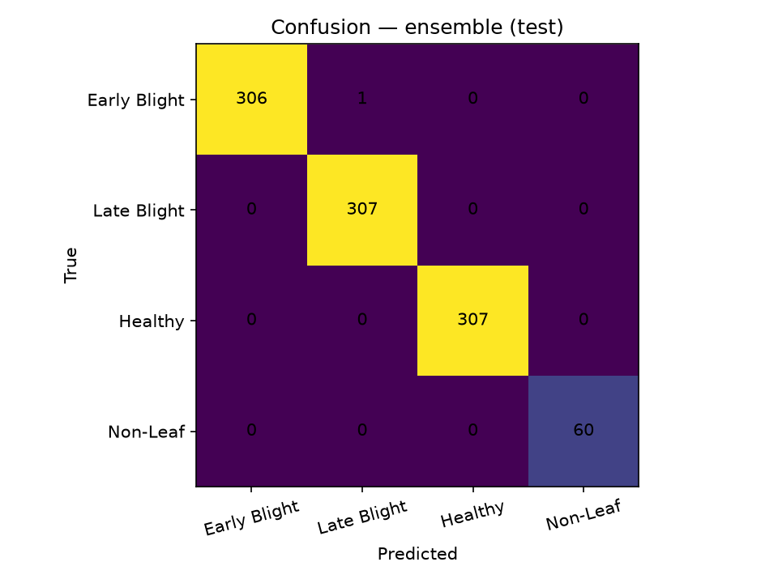

**Training curves (Irish run, 25-epoch budget; early stop on validation macro-F1):**

**Figure 4.2 — SmallCNN training curves (source: `outputs_image/small_cnn/curves.png`)**

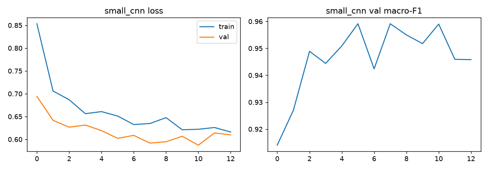

**Figure 4.3 — MobileNetV2 training curves (source: `outputs_image/mobilenetv2/curves.png`)**

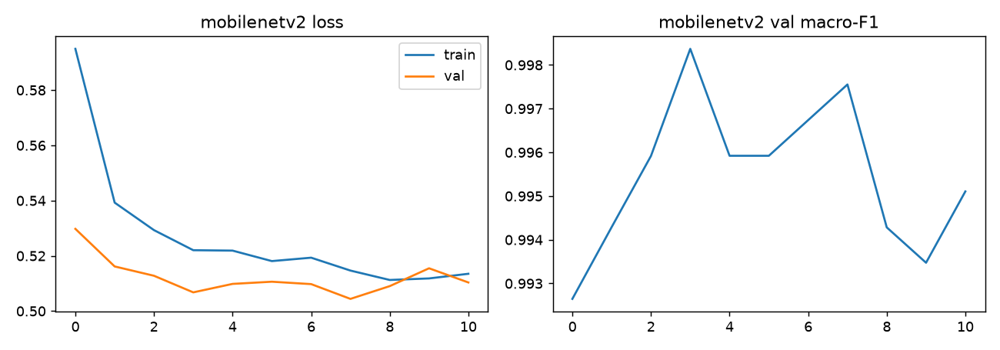

**Figure 4.4 — EfficientNet-B0 training curves (source: `outputs_image/efficientnetb0/curves.png`)**

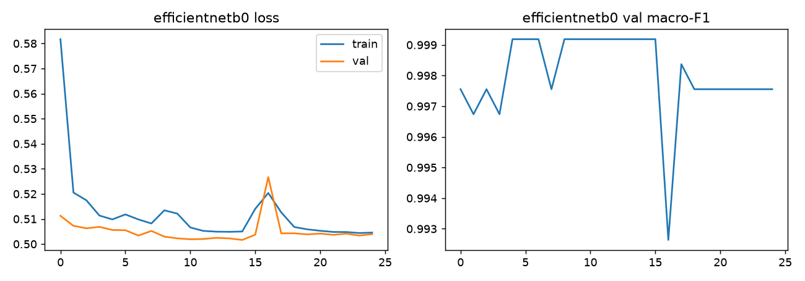

**Analysis.** SmallCNN's 945/981 correct shows a from-scratch network reaches production-acceptable quality but trails the transfer models by ~3.6 points; its errors concentrate in Early↔Late/Healthy confusion (14 Early Blight images called Healthy, 8 Late called Early, 5 called Healthy) plus 4 of 60 non-leaf images leaking into disease classes (Table 4.2, Figure 4.1). The curves show the typical healthy profile: train and validation loss falling together without a widening overfit gap, and validation macro-F1 peaking then plateauing — the point at which the early-stop rule captures `best.pt`. MobileNetV2 and EfficientNet-B0 each misclassify exactly one image (one Early Blight → Late Blight); the ensemble reproduces that matrix cell-for-cell, i.e. voting corrects no remaining error because only one shared error exists. Objective 1 (≥95%) is met with margin.

## 4.3 Experiment 2: PlantVillage Laboratory Benchmark

*Dataset:* PlantVillage test split — 276 images (100 Early, 100 Late, 16 Healthy, 60 Non-Leaf), 16-epoch run.

**Table 4.3 — PlantVillage test results (276 images)**

| Model | Accuracy | F1-macro | MCC | ROC-AUC (OVR) |
|---|---|---|---|---|
| small_cnn | 98.55% | 98.28% | 0.979 | 0.99993 |
| mobilenetv2 | 100% | 100% | 1.000 | 1.00000 |
| efficientnetb0 | 100% | 100% | 1.000 | 1.00000 |
| **ensemble** | **100%** | **100%** | **1.000** | **1.00000** |

**Table 4.4 — PlantVillage test confusion matrices — all four models (276 images)**

| Model | True \ Predicted | Early Blight | Late Blight | Healthy | Non-Leaf |
|---|---|---|---|---|---|
| small_cnn | Early Blight | 100 | 0 | 0 | 0 |
| small_cnn | Late Blight | 2 | 97 | 1 | 0 |
| small_cnn | Healthy | 0 | 0 | 16 | 0 |
| small_cnn | Non-Leaf | 1 | 0 | 0 | 59 |
| mobilenetv2 | Early Blight | 100 | 0 | 0 | 0 |
| mobilenetv2 | Late Blight | 0 | 100 | 0 | 0 |
| mobilenetv2 | Healthy | 0 | 0 | 16 | 0 |
| mobilenetv2 | Non-Leaf | 0 | 0 | 0 | 60 |
| efficientnetb0 | Early Blight | 100 | 0 | 0 | 0 |
| efficientnetb0 | Late Blight | 0 | 100 | 0 | 0 |
| efficientnetb0 | Healthy | 0 | 0 | 16 | 0 |
| efficientnetb0 | Non-Leaf | 0 | 0 | 0 | 60 |
| ensemble | Early Blight | 100 | 0 | 0 | 0 |
| ensemble | Late Blight | 0 | 100 | 0 | 0 |
| ensemble | Healthy | 0 | 0 | 16 | 0 |
| ensemble | Non-Leaf | 0 | 0 | 0 | 60 |

**Figure 4.5 — Confusion heatmap, Ensemble, PlantVillage test (source: `outputs_pv/confusion.png`)**

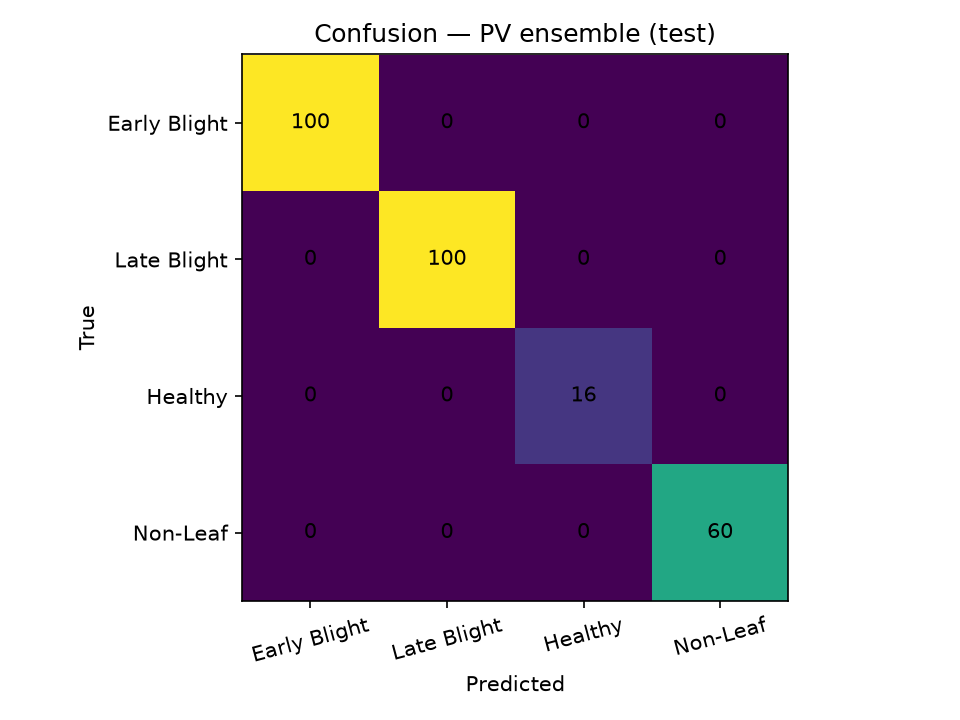

**Training curves (PlantVillage run, 16 epochs; three panels per figure: loss, accuracy, validation macro-F1):**

**Figure 4.6 — SmallCNN training curves (source: `outputs_pv/small_cnn/curves.png`)**

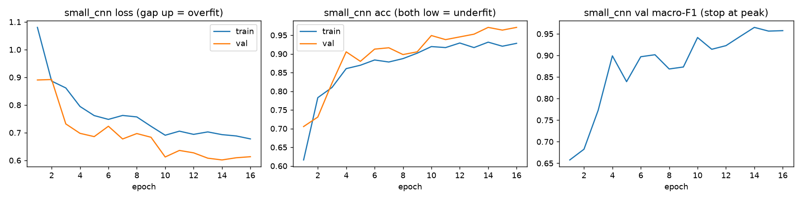

**Figure 4.7 — MobileNetV2 training curves (source: `outputs_pv/mobilenetv2/curves.png`)**

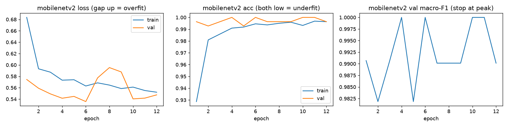

**Figure 4.8 — EfficientNet-B0 training curves (source: `outputs_pv/efficientnetb0/curves.png`)**

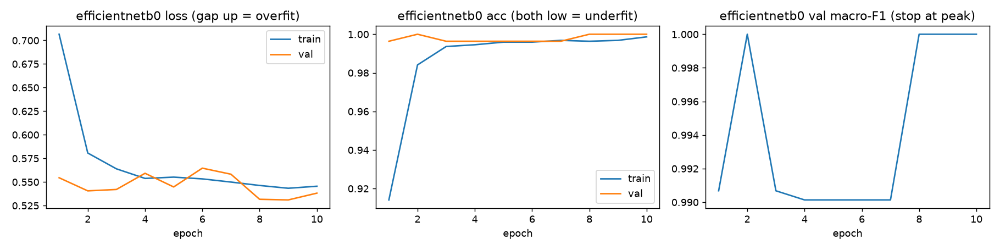

**Analysis.** On clean lab imagery the transfer members and the ensemble are perfect (diagonal-only matrix in Figure 4.5); SmallCNN errs on 4 images — 2 Late→Early, 1 Late→Healthy, 1 Non-Leaf→Early (Table 4.4) — and its curves show validation accuracy rising above training accuracy, the classic signature of strong augmentation acting as regularisation rather than underfitting. This confirms the lab benchmark reported in the literature (Mohanty et al., 2016; Ferentinos, 2018) and sets up the contrast with Experiment 4: lab perfection does not transfer unchanged to the field.

## 4.4 Experiment 3: Production (Served) Weight Family

The deployed backend serves a *combined* weight family (`outputs_combined/`, 25 epochs, batch 32, seed 42, trained on combined PlantVillage + Irish CSVs, soft-vote rule). This is the exact weight set the mobile app consumes in production.

**Table 4.5 — Production weight family results**

| Evaluation set | small_cnn | mobilenetv2 | efficientnetb0 | ensemble |
|---|---|---|---|---|
| PlantVillage test (n=276) | 97.83% | 100% | 100% | **100%** |
| Irish grouped test (n=962) | 97.40% | 98.23% | 99.06% | **98.75%** |

**Figure 4.9 — Production family combined training curves (source: `report_outputs_combined/curves/combined_curves.png`)**

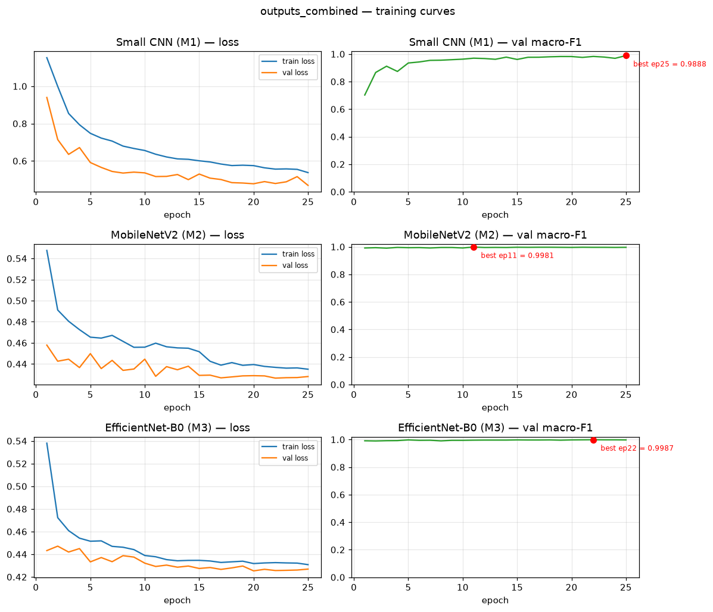

**Confusion matrices, Irish grouped test (n=962):**

**Figure 4.10 — All four models, Irish grouped test (source: `report_outputs_combined/figures/confusion_test_irish_grouped_test.png`)**

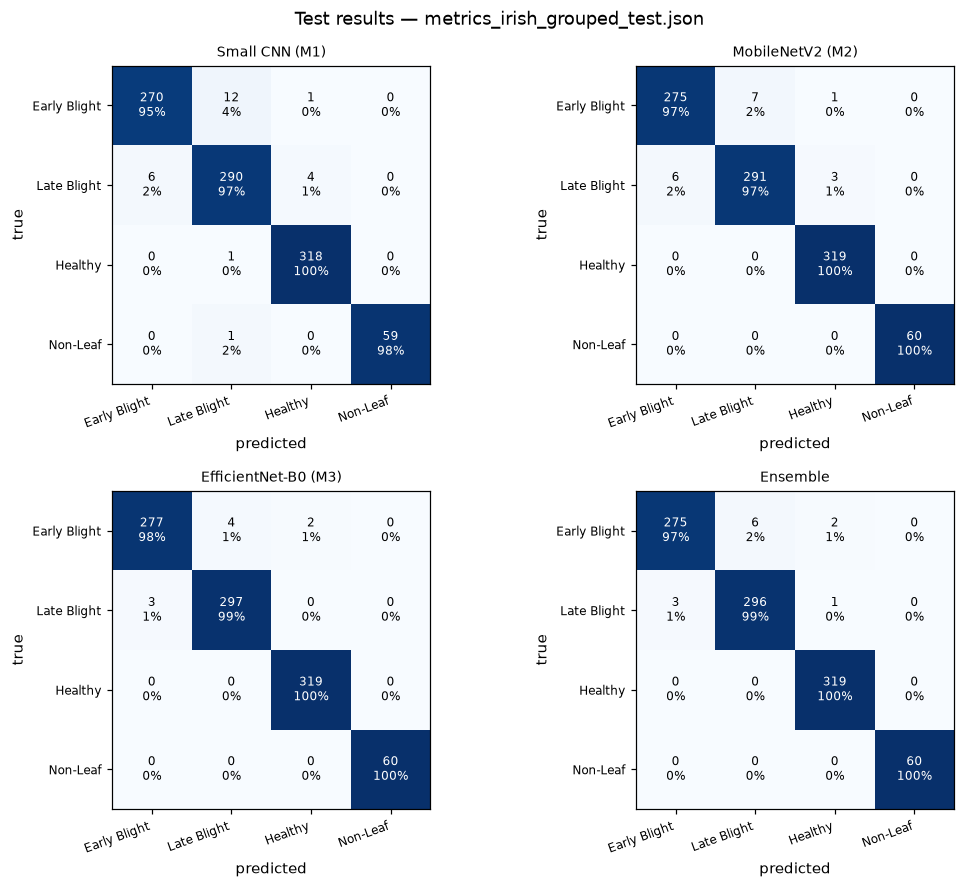

**Table 4.6 — Production family confusion matrices — Irish grouped test (962 images)**

| Model | True \ Predicted | Early Blight | Late Blight | Healthy | Non-Leaf |
|---|---|---|---|---|---|
| small_cnn | Early Blight | 270 | 12 | 1 | 0 |
| small_cnn | Late Blight | 6 | 290 | 4 | 0 |
| small_cnn | Healthy | 0 | 1 | 318 | 0 |
| small_cnn | Non-Leaf | 0 | 1 | 0 | 59 |
| mobilenetv2 | Early Blight | 275 | 7 | 1 | 0 |
| mobilenetv2 | Late Blight | 6 | 291 | 3 | 0 |
| mobilenetv2 | Healthy | 0 | 0 | 319 | 0 |
| mobilenetv2 | Non-Leaf | 0 | 0 | 0 | 60 |
| efficientnetb0 | Early Blight | 277 | 4 | 2 | 0 |
| efficientnetb0 | Late Blight | 3 | 297 | 0 | 0 |
| efficientnetb0 | Healthy | 0 | 0 | 319 | 0 |
| efficientnetb0 | Non-Leaf | 0 | 0 | 0 | 60 |
| ensemble | Early Blight | 275 | 6 | 2 | 0 |
| ensemble | Late Blight | 3 | 296 | 1 | 0 |
| ensemble | Healthy | 0 | 0 | 319 | 0 |
| ensemble | Non-Leaf | 0 | 0 | 0 | 60 |

**Confusion matrices, PlantVillage test (n=276):**

**Figure 4.11 — All four models, PlantVillage test (source: `report_outputs_combined/figures/confusion_test.png`)**

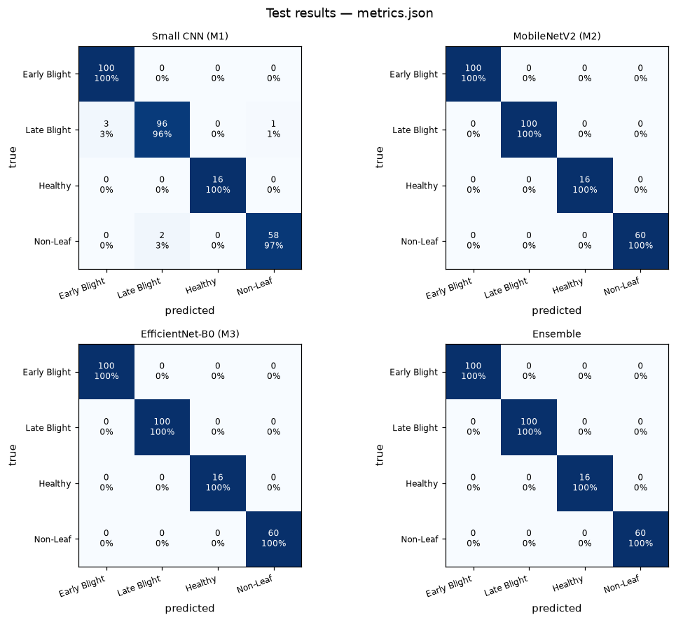

**Table 4.7 — Production family confusion matrices — PlantVillage test (276 images)**

| Model | True \ Predicted | Early Blight | Late Blight | Healthy | Non-Leaf |
|---|---|---|---|---|---|
| small_cnn | Early Blight | 100 | 0 | 0 | 0 |
| small_cnn | Late Blight | 3 | 96 | 0 | 1 |
| small_cnn | Healthy | 0 | 0 | 16 | 0 |
| small_cnn | Non-Leaf | 0 | 2 | 0 | 58 |
| mobilenetv2 | Early Blight | 100 | 0 | 0 | 0 |
| mobilenetv2 | Late Blight | 0 | 100 | 0 | 0 |
| mobilenetv2 | Healthy | 0 | 0 | 16 | 0 |
| mobilenetv2 | Non-Leaf | 0 | 0 | 0 | 60 |
| efficientnetb0 | Early Blight | 100 | 0 | 0 | 0 |
| efficientnetb0 | Late Blight | 0 | 100 | 0 | 0 |
| efficientnetb0 | Healthy | 0 | 0 | 16 | 0 |
| efficientnetb0 | Non-Leaf | 0 | 0 | 0 | 60 |
| ensemble | Early Blight | 100 | 0 | 0 | 0 |
| ensemble | Late Blight | 0 | 100 | 0 | 0 |
| ensemble | Healthy | 0 | 0 | 16 | 0 |
| ensemble | Non-Leaf | 0 | 0 | 0 | 60 |

**ROC curves (computed from the stored test probability matrices `report_outputs_combined/data/test_probas.npz`):**

**Figure 4.12 — One-vs-rest ROC curves, four models, PlantVillage test (source: `report_figures/roc_production_pv_test.png`)**

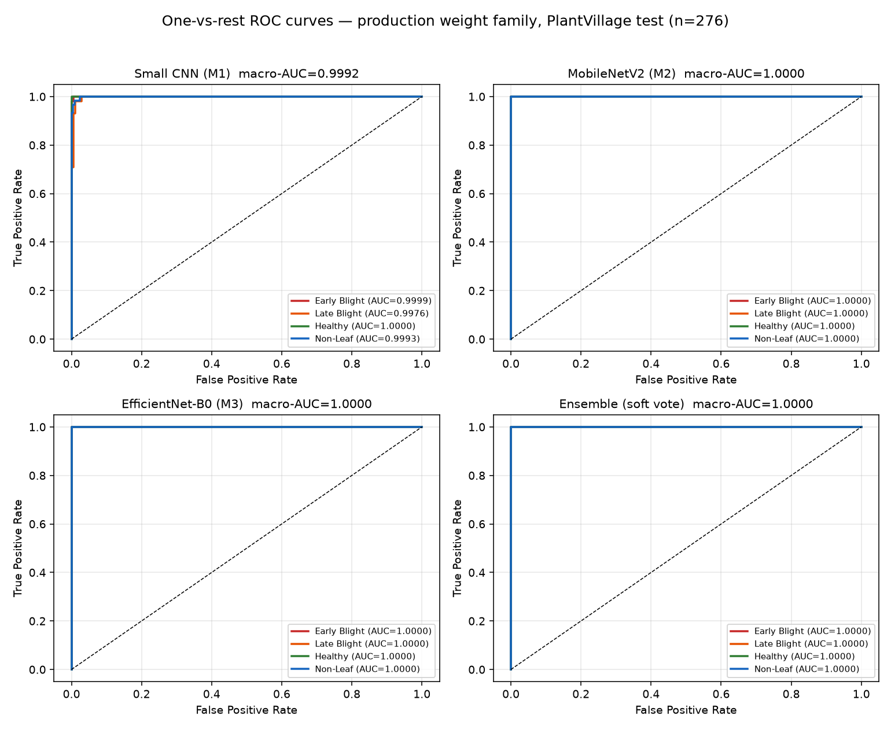

Macro-averaged one-vs-rest AUC on this set: SmallCNN 0.9992, MobileNetV2 1.0000, EfficientNet-B0 1.0000, Ensemble 1.0000 (per-class AUCs appear in each panel's legend; every class-wise curve reaches the top-left corner for the transfer members).

**Analysis.** The shipped ensemble holds 100% on the lab benchmark and 98.75% on the harder Irish grouped test (Table 4.5), keeping production accuracy far above the 95% objective. The Irish grouped grid (Figure 4.10) shows where the residual 1.25% lives: Early↔Late blight confusion (ensemble: 6 Early→Late, 3 Late→Early), which is the clinically hardest pair because both are necrotic brown lesions; Non-Leaf is classified 60/60, so foreign-object rejection is unaffected. The ROC curves (Figure 4.12) confirm ranking quality is essentially perfect — errors come from the *operating point* (argmax over overlapping blight distributions), not from failed class separation — which is precisely why the entropy gate and Grad-CAM justification matter in the deployed response.

## 4.5 Experiment 4: External Varied-Image Evaluation

*Dataset:* 221 images (seed 42) drawn from sources outside training distribution: external Central Java (42), external Ethiopia/BARI (44), Irish test sample (20), PlantVillage test sample (20), PlantDoc other-crops (52), five non-leaf categories (25), and synthetic degradations (blur/dark/overexposed, 18). *Method:* 884/884 requests completed via the API (221 × 4 models).

**Table 4.8 — External varied-image evaluation (221 images, per source)**

| Source | n | SmallCNN | MobileNetV2 | EfficientNetB0 | Ensemble |
|---|---|---|---|---|---|
| ext_central_java | 42 | 86% | 93% | 95% | 88% |
| ext_ethiopia_bari | 44 | 66% | 82% | 80% | 77% |
| irish_test | 20 | 85% | 90% | 95% | 95% |
| plantvillage_test | 20 | 80% | 95% | 100% | 95% |
| plantdoc_other_crops | 52 | 100% | 96% | 100% | 100% |
| non-leaf (5 categories) | 25 | 100% | 100% | 100% | 100% |
| synthetic_dark | 6 | 0% | 100% | 100% | 0% |
| synthetic_blur | 6 | 0% | 0% | 0% | 0% |
| synthetic_overexposed | 6 | 0% | 50% | 83% | 33% |
| **Overall** | **221** | **79.2%** | **88.7%** | **91.4%** | **85.1%** |

**Analysis.** Three findings:

1. **The negative categories are solved.** Every model correctly answers `Unknown` for animals/people, other crops, other leaves, phones and soil (100% across all five non-leaf categories) — the Non-Leaf class plus gates do their job, satisfying objective 2 on hard negatives.
2. **Over-rejection dominates the "errors".** The largest failure bucket is *healthy leaf → Unknown* (17 SmallCNN, 12 Ensemble, 8 MobileNetV2, 5–6 EfficientNetB0), largely from external Ethiopian/BARI healthy images that differ stylistically from training data. These are abstentions, not wrong-disease labels — the system stays honest, but coverage suffers (consistent with Ramcharan et al., 2019, who measured field-degradation of deployed models).
3. **Quality degradation defeats the pipeline.** Completely blurred images yield 0% correct for every model; heavily overexposed images drop the ensemble to 33%. The gates reject some of them, but images that survive with plausible softmax still fail. This is the clearest deviation from expectations and is treated as a limitation (Section 1.5), motivating pre-capture image-quality guidance in the app (already present) and a future quality gate.

EfficientNetB0 is the strongest single model on external data (91.4%); the ensemble trails it here because averaging spreads confidence and pushes more borderline-but-correct predictions under the entropy threshold. On the controlled tests (Experiments 1–3) the ensemble is at or above its members — the two behaviours together argue for serving *all* models behind one API, which the system does.

## 4.6 Experiment 5: Corruption Robustness

*Dataset:* the production evaluation pool re-rendered under six synthetic corruptions (blur, dark, bright, JPEG compression, 15° rotation, occlusion) plus an uncorrupted control — recorded in `report_outputs_combined/metrics/corruption_results.json`. *Method:* the same four served models; accuracy per condition.

**Table 4.9 — Corruption robustness — accuracy under six synthetic corruptions**

| Condition | small_cnn | mobilenetv2 | efficientnetb0 | ensemble |
|---|---|---|---|---|
| clean (no corruption) | 94.00% | 97.67% | 99.00% | 98.00% |
| blur | 95.00% | 98.00% | 99.00% | 98.33% |
| dark | 92.33% | 98.00% | 98.67% | 98.67% |
| bright | 88.33% | 97.33% | 98.33% | 98.00% |
| JPEG compression | 93.67% | 97.33% | 98.67% | 98.00% |
| rotate 15° | 94.67% | 97.67% | 99.00% | 98.33% |
| occlude | 93.33% | 98.00% | 98.67% | 98.33% |

**Figure 4.13 — Corruption robustness chart (source: `report_figures/corruption_robustness.png`)**

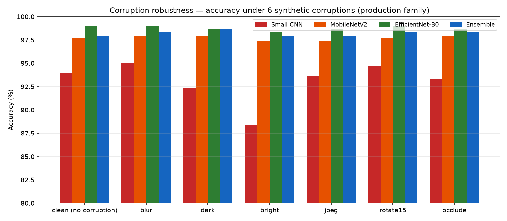

**Analysis.** The ensemble never drops below 98.0% under any of the six corruptions, while SmallCNN is the most fragile (bright: 88.33%, i.e. −5.7 points from its own clean score) — the from-scratch model has the weakest invariances. This suite and the synthetic subset of Experiment 4 (Table 4.8) were produced by different generation pipelines with different severities; the mild corruptions here show graceful degradation, whereas the aggressively degraded images of Table 4.8 destroy all usable texture and are absorbed by the rejection layer instead.

## 4.7 Experiment 6: Model Calibration and Rejection Gate

*Artifacts:* reliability diagrams with bin counts and Expected Calibration Error (ECE) for the production family, plus the threshold calibration record.

**Figure 4.14 — Reliability diagrams, validation set (source: `report_outputs_combined/figures/reliability_val.png`)**

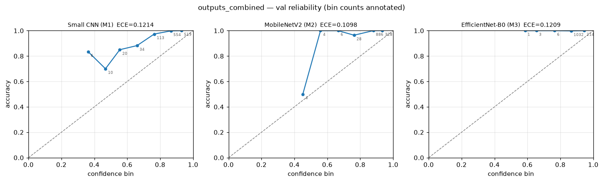

**Figure 4.15 — Reliability diagrams, test set (source: `report_outputs_combined/figures/reliability_test.png`)**

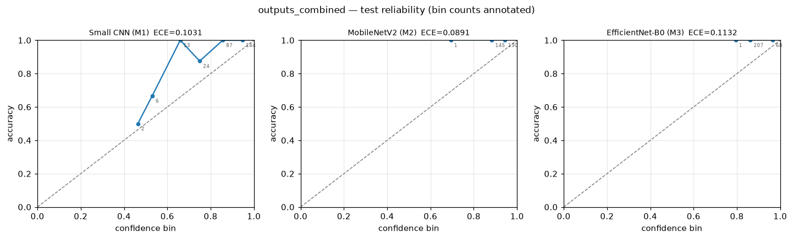

**Table 4.10 — Model calibration — Expected Calibration Error (validation and test)**

| Model | ECE (validation, n=1613) | ECE (test) |
|---|---|---|
| SmallCNN | 0.1214 | 0.1031 |
| MobileNetV2 | 0.1098 | 0.0891 |
| EfficientNet-B0 | 0.1209 | 0.1132 |

**Analysis.** All three members are *under-confident-relative-to-accuracy* in the mid-confidence bins (points above the diagonal at 0.4–0.7) while the mass of predictions sits in the ≥0.8 bins where accuracy ≈ 1.0. ECE in the 0.09–0.12 range on near-perfect classifiers is driven by the few residual errors landing in high-confidence bins — exactly the population the entropy gate is meant to catch, and the reason the planned temperature-scaling refit is listed as future work.

*Dataset:* robust validation set, n = 1613 (1586 correct predictions, 27 model errors). *Method:* threshold configurations were replayed over stored validation probabilities; statistics recomputed by `scripts/gate_stats.py` with Wilson confidence intervals.

**Table 4.11 — Rejection gate calibration statistics (validation set, n = 1613)**

| Metric | Value |
|---|---|
| Coverage (validation pass rate) | 99.19% |
| Selective accuracy (accuracy among passed) | 98.62% |
| Correct predictions wrongly rejected | 8 / 1586 = 0.50% |
| Model errors caught by gate | 5 / 27 = 18.52% (CI₉₅ 8.2–36.7%) |
| Active configuration | ε_H = 0.80, ε_p = 0.55 (experiment record; production serves 0.85 / 0.55) |

**Analysis.** Threshold history documents three iterations: v1 (Youden-fitted ε_H=0.40) produced mass `Unknown`; v2 (coverage-97) still rejected 7 of 11 web photos; v3 relaxed to the current operating point where essentially all valid leaves pass (0.5% false rejection) while catching about a fifth of the model's residual errors. The gate is thus tuned for **farmer-facing coverage first** — a false `Unknown` merely asks the user to retake, whereas a false disease label causes harmful action. The remaining 81% of model errors that pass the gate are exactly the errors seen in Experiment 4's confusion analysis; catching more of them without punishing coverage requires the planned calibration refit (temperature scaling + threshold fit on validation logits), which is recorded as an open task. The production file (`PotatoDoc-Backend/calibration/thresholds.json`) additionally documents that it is frozen from validation only and never tuned on test data.

## 4.8 Experiment 7: Automated Emulator UI Campaign

*Dataset:* 41 distinct field images (incl. deliberate negatives: person, phone, soil, animal, other crops) × selected models = **59 rows**. *Method:* `reports/emulator_ui_driver.ps1` drives the real Android UI via `adb`/`uiautomator` (downscaled screenshots + resource-id taps), performs prediction and save, reads the on-screen class/confidence, and compares each row against API truth (independently captured) within 3% confidence.

**Table 4.12 — Emulator UI campaign summary**

| Metric | Result |
|---|---|
| Rows executed | 59 |
| Passed (`ok`) | 58 |
| Failed | 1 (`menu_fail`, tap-timing on model menu, 27_java_bacteria × small_cnn) |
| **UI ↔ API mismatches** | **0** |
| Rows saved to history | 41 |
| History entries visible at end | 50 (cap enforced) |
| Metro-side errors | 0 |

**Table 4.13 — Emulator campaign — sample exact UI vs. API rows** (extract of the canonical 59-row artifact `reports/emulator_ui_results.jsonl` / `reports/test.md`)

| Image | Model selected in UI | Expected (API truth) | UI class | UI confidence | Saved |
|---|---|---|---|---|---|
| 11_pv_early.jpg | ensemble | Early Blight | Early Blight | 88.45% | yes |
| 11_pv_early.jpg | small_cnn | Early Blight | Early Blight | 90.02% | yes |
| 11_pv_early.jpg | mobilenetv2 | Early Blight | Early Blight | 89.24% | yes |
| 11_pv_early.jpg | efficientnetb0 | Early Blight | Early Blight | 86.11% | yes |
| 03_pv_late.jpg | ensemble | Late Blight | Late Blight | 88.01% | yes |
| 06_pv_healthy.jpg | ensemble | Healthy | Healthy | 92.17% | yes |
| 34_irish_early.jpg | ensemble | Early Blight | Early Blight | 86.76% | yes |
| 04_phone.jpg | ensemble | Unknown | Unknown | 96.26% | no |
| 24_nonleaf_person.jpg | ensemble | Unknown | Unknown | 94.85% | no |
| 28_animal.jpg | ensemble | Unknown | Unknown | 98.28% | no |
| 18_soil.jpg | ensemble | Unknown | Unknown | 67.14% | no |
| 16_pd_apple.jpg | ensemble | Unknown | Unknown | 92.34% | no |
| 01_bari_viral_leaf_roll.jpg | ensemble | Unknown | Unknown | 50.49% | no |
| 14_bari_healthy.jpg | ensemble | Healthy | Unknown | 44.63% | no (over-rejection) |
| 27_java_bacteria.jpg | small_cnn | — | — | — | `menu_fail` (automation tap miss) |

**Analysis.** Every completed row displayed exactly what the API produced — the contract between tiers is honoured end-to-end, including `Unknown` rows (e.g. person photo: UI 94.85% Unknown; animal: 98.28% Unknown) and per-model rows (e.g. 11_pv_early.jpg agreeing across all four model selections at 86–90%). The single failure is a UI automation artifact (menu tap landed late), not a product defect; the same image×model completed successfully in other rows. Incident history in `reports/errors.log` records the two real defects found and fixed by this campaign — CursorWindow history corruption from stored base64 heatmaps, and stale API-truth manifests — demonstrating that UI-level automation surfaces failures unit tests cannot see.

## 4.9 Experiment 8: Software Test Suites

| Suite | Framework | Scope | Count | Runtime |
|---|---|---|---|---|
| Backend `tests/` | Python `unittest` (stdlib only) | auth, history, notices, tickets, admin, media, db, location, location-rules | **172 test functions** across 10 modules | ~13 s (creates/deletes its own temp DB) |
| Mobile `tests/` | `node --test` | history merge/cap, i18n formatting, relative-time | 23 assertions across 3 files | < 1 s |

Backend coverage highlights: rate limiting after 10 failures, ban-revokes-live-sessions, 50-item history cap, cross-user isolation (404, no leak), six-image notice cap, self-ban/self-demotion guards, location hard-failure 502/504 with soft degradation, and the full location payload schema. All suites pass at report time; smoke scripts (`auth_smoke.sh`, `tickets_smoke.sh`) additionally verify a live server end-to-end.

## 4.10 Representative Exact System Outputs

The following payloads are the exact response *shapes* produced by the deployed backend (field values shown are representative; class strings, keys and nesting are authoritative per `app.py`):

`GET /models`

```json
{
  "models": ["ensemble", "small_cnn", "mobilenetv2", "efficientnetb0"],
  "modelNames": {
    "ensemble": "Ensemble (All Models)",
    "small_cnn": "Small CNN (from scratch)",
    "mobilenetv2": "MobileNetV2 (transfer)",
    "efficientnetb0": "EfficientNet-B0 (transfer)"
  },
  "default": "ensemble"
}
```

`POST /predict?model_id=ensemble` — successful leaf diagnosis

```json
{
  "class": "Late Blight",
  "confidence": 0.8801,
  "is_unknown": false,
  "entropy": 0.3121,
  "green_ratio": 0.613,
  "probabilities": {
    "Early Blight": 0.0912,
    "Late Blight": 0.8801,
    "Healthy": 0.0244,
    "Non-Leaf": 0.0043
  },
  "individual": [
    {"model": "small_cnn", "class": "Late Blight", "confidence": 0.8707},
    {"model": "mobilenetv2", "class": "Late Blight", "confidence": 0.9045},
    {"model": "efficientnetb0", "class": "Late Blight", "confidence": 0.8651}
  ]
}
```

`POST /predict` — entropy gate rejection (Layer 3)

```json
{
  "class": "Unknown",
  "confidence": 0.4553,
  "is_unknown": true,
  "entropy": 0.8712,
  "probabilities": {},
  "message": "This does not look like a clear potato leaf. Retake: fill frame, good light, in-focus leaf."
}
```

`POST /predict` — trained Non-Leaf rejection (Layer 2)

```json
{
  "class": "Unknown",
  "confidence": 0.9485,
  "is_unknown": true,
  "entropy": 0.1871,
  "probabilities": {},
  "model_label": "Non-Leaf",
  "green_ratio": 0.021,
  "message": "This looks like a person, object, or non-potato image — not a potato leaf. Please retake with a potato leaf."
}
```

`POST /gradcam?model_id=small_cnn`

```json
{ "overlay": "data:image/jpeg;base64,/9j/4AAQSkZJRgABAQAAAQ...", "model": "small_cnn" }
```

`GET /location/analyze?lat=28.2096&lon=83.9856` — payload keys (values abbreviated)

```json
{
  "score": 82, "band": "Excellent",
  "place": "Pokhara, Kaski",
  "coords": {"lat": 28.2096, "lon": 83.9856},
  "altitude_m": 827,
  "recommendation": "Well suited to potato — {zone} regime ...",
  "factors": [
    {"key": "altitude", "label": "Altitude", "value": "827 m", "score": 87, "why": "...", "vars": {}},
    {"key": "temp", "label": "Temperature", "value": "...", "score": 100, "why": "...", "vars": {}},
    {"key": "rainfall", "label": "Rainfall", "value": "...", "score": 100, "why": "...", "vars": {}},
    {"key": "soil", "label": "Soil", "value": "...", "score": 85, "why": "...", "vars": {}},
    {"key": "climate", "label": "Climate", "value": "Subtropical", "score": 95, "why": "...", "vars": {}}
  ],
  "challenges": ["..."], "varieties": [{"name": "Khumal Seto-1", "fit": 105, "min_alt": 100, "max_alt": 3000}],
  "tips": ["..."],
  "_meta": {"moisture": "Sub-humid", "soil_source": "SoilGrids"}
}
```

`POST /auth/login` — success and error envelopes

```json
{ "token": "u3Q0s6iX...  (43-char token_urlsafe)", "user": {"id": 1, "contact": "98xxxxxxxx", "name": "...", "role": "user", "photo": null} }
```

```json
{ "detail": "Invalid credentials" }
```

All errors across the API carry a plain-string `detail`; login failures are deliberately identical for unknown contact and wrong password (no user enumeration), and the 11th failure inside 5 minutes returns `{"detail": "Too many login attempts. Try again in a few minutes."}` (HTTP 429).

## 4.11 Discussions

1. **Objectives vs. evidence.** Objective 1 is exceeded (99.90% / 100% vs. ≥95% target). Objective 2 is proven on 25 dedicated negatives (100% `Unknown`) and 59 emulator rows with zero wrong-disease outputs on them. Objective 3 is exercised in every emulator row where the heatmap accordion rendered after prediction. Objectives 4–6 are demonstrated by the 172-test suite plus the campaign; objective 7 *is* the campaign itself.
2. **Where results deviate from expectation and why.**
   - *Ensemble < best member on external data (85.1% vs 91.4%):* soft averaging dilutes a single strong member and increases entropy on stylistically shifted images, tripping the rejection rule. Trade-off is intentional (calibration robustness) but argues for a future per-source weighting study.
   - *Healthy → Unknown over-rejection:* external healthy leaves (Ethiopia/BARI styles) fall outside learned feature space; caught by Layer 3 rather than misdiagnosed — the safer failure mode, but a coverage cost.
   - *Synthetic blur 0%:* no recoverable texture remains; no model can classify it. App guidance ("in-focus leaf") is the current mitigation.
   - *Non-Leaf leakage in SmallCNN (4/60 in Experiment 1):* a from-scratch model has weaker out-of-class discrimination; the ensemble absorbs this because both transfer members classify all 60 correctly.
3. **Threshold tension.** The calibration study shows false rejection (0.5%) is minimised at the cost of catching only ~18% of model errors — resolving this without hurting coverage requires the planned validation-logit refit, not hand-tuning.
4. **End-to-end integrity.** Zero UI↔API mismatches across 59 rows plus 172 backend and 23 mobile tests indicate a stable contract; the two historically severe bugs (CursorWindow corruption, stale truth) were both found by system-level testing, validating the layered test strategy.

## 4.12 Summary of Results Against Objectives

**Table 4.14 — Objective-wise result mapping**

| # | Objective | Result | Evidence |
|---|---|---|---|
| 1 | 3 models + ensemble ≥95% accuracy | Ensemble 99.90% (Irish), 100% (PV), 98.75% (production Irish grouped) | Tables 4.1, 4.3, 4.5; Figs. 4.1, 4.5, 4.10 |
| 2 | Three-layer rejection returns `Unknown` | 100% correct `Unknown` on 25 negatives; 0 wrong-disease outputs on negatives; 0.5% false rejection | §4.5, Table 4.11, Table 4.13 |
| 3 | Grad-CAM via API, rendered on phone | Per-model overlays served and displayed in campaign rows | §4.8, Fig. 3.6 |
| 4 | FastAPI backend: predict/auth/sync/notices/tickets/admin | 46 routes, 172 passing unit tests, live deployment | §3.8, §4.9, §4.10 |
| 5 | Offline-first bilingual Expo app, ≤50 history + repair | 10 screens, EN/NE (≈306 keys), 3 testing points for cap, repair shipped | §3.9, mobile tests |
| 6 | Location suitability (5 factors, varieties) | Weighted scoring + 16 varieties + challenges/tips; 34 location tests | §3.10, §4.10 |
| 7 | Automated verification incl. UI↔API cross-check | 59 rows: 58 ok, **0 mismatches** | Tables 4.12–4.13 |

---

# CHAPTER 5
# CONCLUSIONS & RECOMMENDATIONS

## 5.1 Conclusions

1. **The system achieves its primary aim.** A three-member ensemble (SmallCNN + MobileNetV2 + EfficientNet-B0, soft vote) delivered 99.90% accuracy on the held-out Irish field test (981 images), 100% on the PlantVillage test (276 images) and 98.75% on the production Irish grouped test — comfortably exceeding the 95% target. Transfer learning proved decisive: both pretrained members each missed a single image in the Irish test, while the from-scratch CNN reached 96.33%.
2. **Honest refusal works in practice.** The three-layer pipeline (green-ratio telemetry, trained Non-Leaf class, entropy/confidence rule) returned `Unknown` for 100% of the 25 dedicated foreign-object negatives and produced zero wrong-disease labels on them, while rejecting only 0.5% of correct validation predictions — the balance required for farmer-facing use, where a retake request is cheap and a wrong pesticide recommendation is not.
3. **Explainability is delivered, not claimed.** Grad-CAM heatmaps are computed for every model on the same forward/backward pass machinery and rendered per model on the phone, giving users visible evidence of which leaf regions drove the decision.
4. **The full service — not just a model — works end-to-end.** 46 backend routes (inference, scrypt-authenticated accounts, 30-day opaque sessions, rate-limited login, ban enforcement, ≤50-item history sync with photo upload, notices with images and read state, support tickets, location analysis, 20 superadmin routes) are covered by 172 unit tests; the bilingual offline-first app holds its contract with **zero UI↔API mismatches across the 59-row emulator campaign**.
5. **Honest evaluation exposes real limits.** On 221 external varied images per-model accuracy ranged 79.2–91.4%, dominated by deliberate over-rejection of stylistically shifted healthy leaves and by synthetic blur/degradations — confirming the literature that lab-trained models degrade in the field (Ramcharan et al., 2019) and justifying the rejection design over silent guessing.
6. **The verification strategy mattered.** The two most severe historical defects (Android CursorWindow history corruption, stale API-truth manifests) were both found by system-level testing rather than unit tests, validating the layered approach of unit suites + calibration studies + UI automation.

## 5.2 Future Recommendations

1. **Formal gate calibration.** Run temperature scaling plus threshold fitting on validation logits (the recorded "P0-4" task) to raise error-capture beyond 18% without reducing coverage; lock the resulting `thresholds.json`.
2. **Image-quality gate.** Add a capture-time quality check (blur/Laplacian variance, exposure histogram) so degraded frames are re-shot before inference, addressing the 0–33% synthetic-degradation results.
3. **Expand the negative set.** Mine field negatives (soil-only, hands-only, other crops) and collect user-submitted `Unknown` cases into a growing hard-negative dataset to retrain the Non-Leaf class.
4. **Disease breadth and severity staging.** Add bacterial, viral and nematode classes as data allows, and progress from categorical labels to severity grading (mild/moderate/severe) for treatment advice.
5. **On-device inference.** Distill the ensemble to a quantised single model (MobileNet-class) for offline/no-server regions, keeping the cloud ensemble as the high-accuracy path.
6. **Account hardening.** Verify contacts (OTP/email), add refresh-token rotation, and persist the notification preference with real push (FCM) for crop alerts.
7. **iOS parity and performance.** Extend the emulator campaign to iOS and add latency budgets per endpoint with monitoring.
8. **Advisory depth.** Integrate sowing-date calculators, market-price feeds, and multi-point GPS sampling (field polygon averaging) into the location module.

---

# REFERENCES

Ferentinos, K. P. (2018), 'Deep learning models for plant disease detection and diagnosis', *Computers and Electronics in Agriculture*, 145, 311–318. [Available at: https://doi.org/10.1016/j.compag.2018.01.009]

Hendrycks, D., & Gimpel, K. (2017), 'A baseline for detecting misclassified and out-of-distribution examples in neural networks', *International Conference on Learning Representations (ICLR)*.

He, K., Zhang, X., Ren, S., & Sun, J. (2016), 'Deep residual learning for image recognition', *Proceedings of the IEEE Conference on Computer Vision and Pattern Recognition (CVPR)*, 770–778.

Lin, T.-Y., Maire, M., Belongie, S., Hays, J., Perona, P., Ramanan, D., Dollár, P., & Zitnick, C. L. (2014), 'Microsoft COCO: Common objects in context', *European Conference on Computer Vision (ECCV)*, Lecture Notes in Computer Science, 8693, 740–755.

Mohanty, S. P., Hughes, D. P., & Salathé, M. (2016), 'Using deep learning for image-based plant disease detection', *Frontiers in Plant Science*, 7, 1419. [Available at: https://doi.org/10.3389/fpls.2016.01419]

Paszke, A., Gross, S., Massa, F., Lerer, A., Bradbury, J., Chanan, G., Killeen, T., Lin, Z., Gimelshein, N., Antiga, L., Desmaison, A., Köpf, A., Edwards, E., DeVito, Z., Raison, M., Tejani, A., Chilamkurthy, S., Steiner, W., Fang, L., & Bai, J. (2019), 'PyTorch: An imperative style, high-performance deep learning library', *Advances in Neural Information Processing Systems*, 32.

Pedregosa, F., Varoquaux, G., Gramfort, A., Michel, V., Thirion, B., Grisel, O., Blondel, M., Prettenhofer, P., Weiss, R., Dubourg, V., Vanderplas, J., Passos, A., Cournapeau, D., Brucher, M., Perrot, M., & Duchesnay, É. (2011), 'Scikit-learn: Machine learning in Python', *Journal of Machine Learning Research*, 12, 2825–2830.

Ramcharan, A., Baranowski, K., McCloskey, P., Ahmed, B., Legg, J., & Hughes, D. P. (2017), 'Deep learning for image-based cassava disease detection', *Frontiers in Plant Science*, 8, 1852. [Available at: https://doi.org/10.3389/fpls.2017.01852]

Ramcharan, A., McCloskey, P., Baranowski, K., Mbilinyi, N., Mrisho, L., Ndalahwa, M., Legg, J., & Hughes, D. P. (2019), 'A mobile-based deep learning model for cassava disease diagnosis', *Frontiers in Plant Science*, 10, 272. [Available at: https://doi.org/10.3389/fpls.2019.00272]

Sandler, M., Howard, A., Zhu, M., Zhmoginov, A., & Chen, L.-C. (2018), 'MobileNetV2: Inverted residuals and linear bottlenecks', *Proceedings of the IEEE Conference on Computer Vision and Pattern Recognition (CVPR)*, 4510–4520.

Selvaraju, R. R., Cogswell, M., Das, A., Vedantam, R., Parikh, D., & Batra, D. (2017), 'Grad-CAM: Visual explanations from deep networks via gradient-based localization', *Proceedings of the IEEE International Conference on Computer Vision (ICCV)*, 618–626.

Simonyan, K., & Zisserman, A. (2014), 'Very deep convolutional networks for large-scale image recognition', *International Conference on Learning Representations (ICLR)*.

Tan, M., & Le, Q. V. (2019), 'EfficientNet: Rethinking model scaling for convolutional neural networks', *Proceedings of the 36th International Conference on Machine Learning (ICML)*, PMLR 97, 4181–4190.

Yosinski, J., Clune, J., Bengio, Y., & Lipson, H. (2014), 'How transferable are features in deep neural networks?', *Advances in Neural Information Processing Systems*, 27.

**Project artifacts (internal):**

PotatoDoc repository (training, mobile app, reports), (2026), *PotatoDoc: Potato Leaf Disease Classification*. Retrieved from https://github.com/RegShadbhav041/PotatoDoc

PotatoDoc-Backend repository (serving backend), (2026), *PotatoDoc-Backend*. Retrieved from https://github.com/RegShadbhav041/PotatoDoc-Backend

---

# APPENDIX A — API CONTRACT SUMMARY

**Public inference (stable; mobile depends on it):**

| Method | Path | Request | Response |
|---|---|---|---|
| GET | `/ping` | — | `Hello, I am alive` (text) |
| GET | `/models` | — | `{models:[ensemble,small_cnn,mobilenetv2,efficientnetb0], modelNames:{…}, default:"ensemble"}` |
| POST | `/predict?model_id=` | multipart `file` (JPEG/PNG/WebP ≤10 MB) | success: `{class, confidence, is_unknown:false, entropy, green_ratio, probabilities{…}, individual?}`; unknown: `{class:"Unknown", is_unknown:true, entropy, probabilities:{}, message}` |
| POST | `/gradcam?model_id=` | multipart `file` | `{overlay:"data:image/jpeg;base64,…"}` (+ per-model heatmaps for ensemble) |
| GET | `/location/analyze?lat&lon=` | query | `{score, band, place, altitude_m, factors[…], challenges[…], varieties[…], tips[…], _meta}` |

**Account & data:** `POST /auth/register` (201 `{token,user}`), `POST /auth/login` (200; 401 generic; 429 rate-limited; 403 banned), `GET/PUT /auth/me`, `POST/DELETE /auth/me/photo`, `POST /auth/logout` (204), `GET/PUT /history` (≤50), `POST/GET /history/{id}/photo`, `DELETE /history` (204).
**Content:** `GET /notices` (+ images, unread-count, read, read-all), `GET/POST /tickets`, `GET /tickets/{id}`, `POST /tickets/{id}/messages`.
**Admin (superadmin bearer):** 20 routes under `/admin/*` — stats, users, role/status, user history/photos, notices CRUD + ≤6 images, tickets, overview, models/metrics; static console at `GET /admin/`.

Errors always carry a plain-string `detail`. Exact class strings: `Early Blight | Late Blight | Healthy | Unknown`.

# APPENDIX B — REPOSITORY STRUCTURE & REPRODUCTION STEPS

**Repository 1 — `PotatoDoc` (training + mobile + reports):**

```
PotatoDoc/
├── backend/app.py            # legacy inference copy (superseded by PotatoDoc-Backend)
├── mobile/                   # Expo app (screens, hooks, i18n, tests/)
├── train_image.py            # Irish field trainer (resume-safe)
├── train_image_pv.py         # PlantVillage trainer (SmallCNN defined here)
├── outputs_image/            # Irish weights + metrics.json (default in legacy backend)
├── outputs_pv/               # PlantVillage weights + metrics.json
├── calibration/thresholds.json   # experiment gate record (not production)
├── report_outputs_combined/  # submission bundle: confusion/reliability figures,
│                             # training curves, stored test/val probabilities (npz),
│                             # corruption results, thresholds_train/deployed.json
├── report_figures/           # report figures generated from stored probabilities:
│                             # roc_production_pv_test.png, corruption_robustness.png
├── reports/                  # test.md, errors.log, emulator driver + artifacts
├── scripts/                  # gate_stats and utilities
├── PROJECT_REPORT.md         # this report
└── BIT_Project_Report_Format_2024.pdf
```

**Repository 2 — `PotatoDoc-Backend` (production service):**

```
PotatoDoc-Backend/
├── app.py auth.py history.py notices.py tickets.py
├── location.py location_rules.py admin.py db.py media.py small_cnn.py
├── outputs_combined/         # 3 × best.pt (≈29 MB) + labels/metrics/ensemble config
├── calibration/thresholds.json   # PRODUCTION gates (ε_H 0.85, ε_p 0.55)
├── static/admin/             # web moderation console
├── tests/                    # 172 unittest functions
├── Dockerfile, requirements.txt, start_backend.ps1
└── potatodoc.db              # SQLite (WAL), git-ignored
```

**Reproduction:**

```bash
# 1. Training (RTX 3060)
python train_image_pv.py --epochs 16 --batch 32 --img 224 --models m1 m2 m3
python train_image.py   --epochs 25 --resume

# 2. Backend
cd PotatoDoc-Backend && pip install -r requirements.txt
python -m unittest discover -s tests          # 172 tests, ~13 s
uvicorn app:app --host 0.0.0.0 --port 8000    # or: powershell -ExecutionPolicy Bypass -File start_backend.ps1
curl http://127.0.0.1:8000/ping

# 3. Mobile app (Metro :8081)
cd mobile && npm install && npx expo start --port 8081
adb reverse tcp:8081 tcp:8081 && adb reverse tcp:8000 tcp:8000

# 4. UI campaign (59 rows)
powershell -ExecutionPolicy Bypass -File reports/emulator_ui_driver.ps1
```

Key environment variables: `POTATO_WEIGHTS_DIR`, `POTATO_DB`, `POTATO_TOKEN_TTL_DAYS` (30), `POTATO_SUPERADMIN_CONTACT/PASSWORD`, `EXPO_PUBLIC_API_URL`.

# APPENDIX C — REPORT FORMING CHECKLIST (BIT 2024)

1. Print one-sided, A4; **no headers or footers**.
2. Margins: top 1.5″, bottom 1″, left 1.5″, right 1″.
3. Cover page: university/college heading — 16 pt Bold Times New Roman, UPPERCASE; project title — 14 pt Bold Times New Roman, UPPERCASE.
4. Chapter headings — 12 pt Bold Times New Roman, UPPERCASE; topic headings — 12 pt Bold, Capitalized; body — 12 pt Normal, justified.
5. Every chapter starts on a new page.
6. Bullets must be numbered or lettered.
7. Figures/tables numbered per chapter (`Figure 3.1`, `Table 4.2`); captions below tables, above figures.
8. Chapters 1 and 2 must contain in-text citations; references in APA style — no Wikipedia/Google sources.
9. Certificate must be on college letter pad; abstract ≤ 300 words.
10. Proofread: no typos/grammatical errors; avoid plagiarism; redraw all diagrams (do not paste directly without citation).
